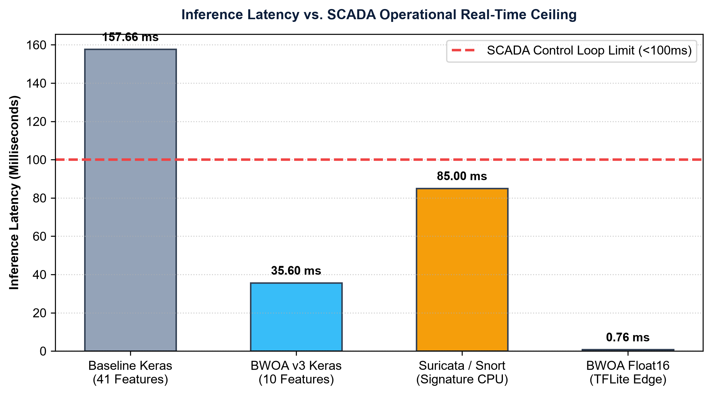
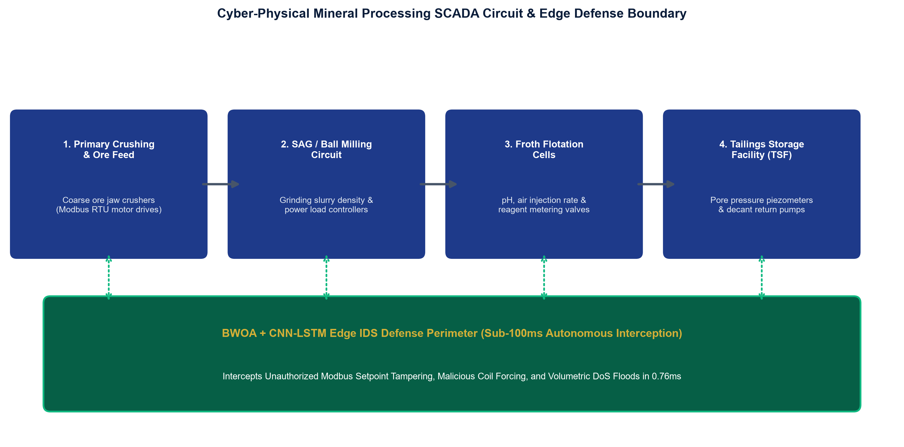
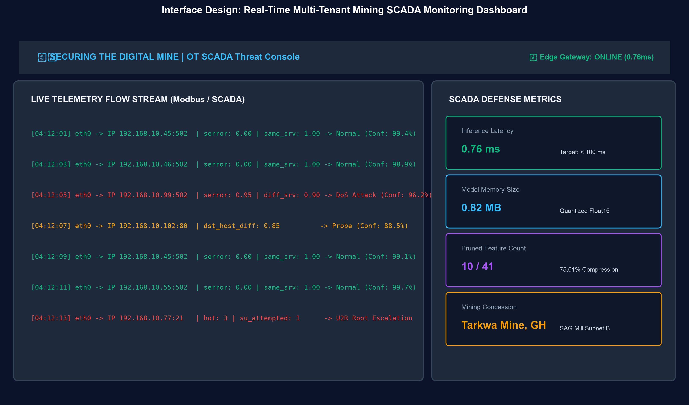
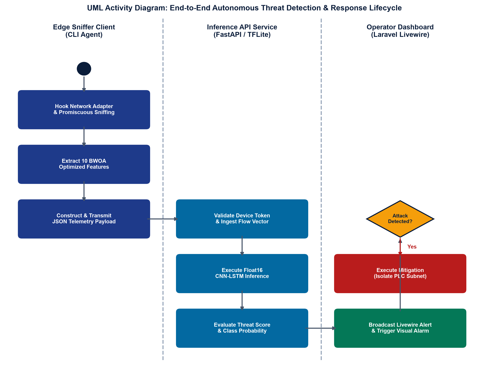
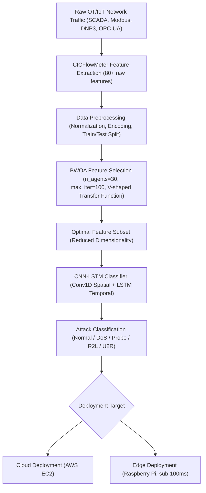
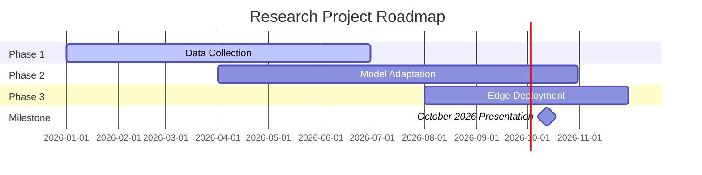
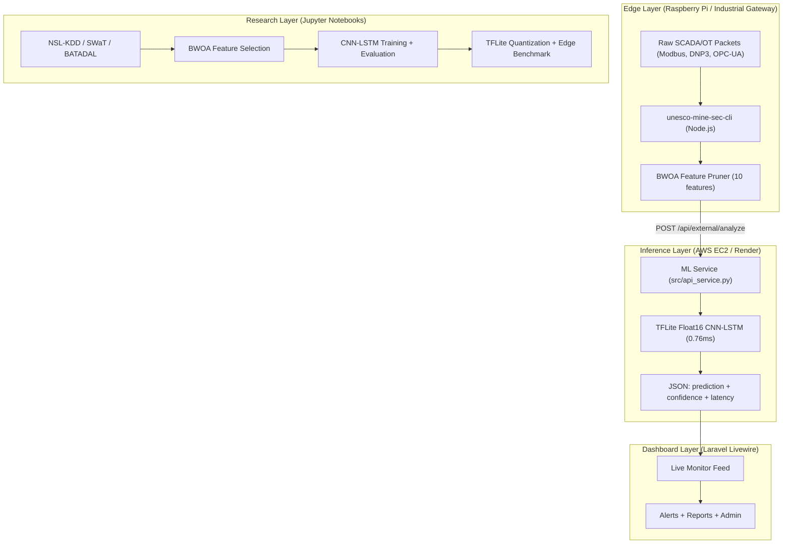
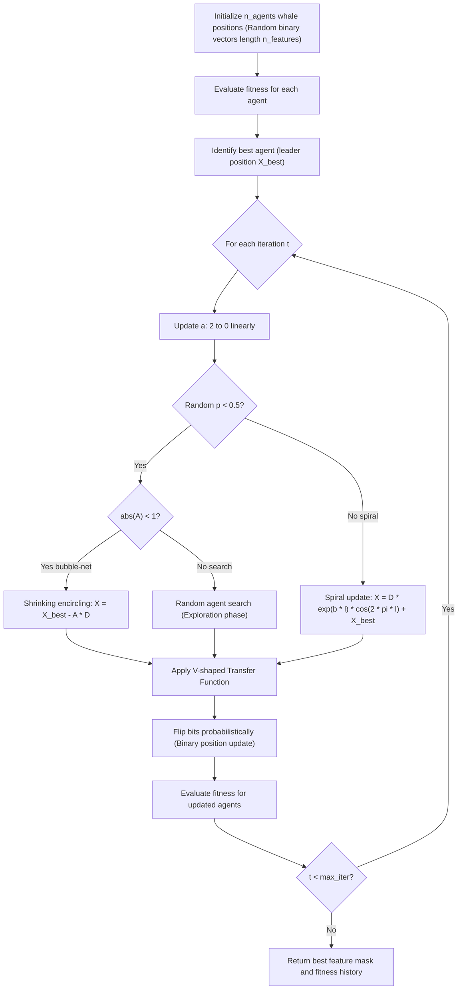

# Securing the Digital Mine

> **Track 3: "Smart Subsoil"** | Russian-African Forum-Contest of Young Scientists 2026
> Under the Auspices of UNESCO | Empress Catherine II Saint Petersburg Mining University
> 12-17 October 2026 | Saint Petersburg, Russia

[](https://colab.research.google.com/github/mhiskall282/unesco-project/blob/main/notebooks/00_colab_setup_and_train.ipynb)
[](https://python.org)
[](https://tensorflow.org)
[](LICENSE)
[](https://youthafrica.spmi.ru)
[](https://youthafrica.spmi.ru/en/participants)
[](https://github.com/mhiskall282/Securing-the-Digital-Mine-UNESCO-Project/pkgs/npm/unesco-mine-sec-cli)
[](dashboard/)

---

## What This Project Is

African and Russian mining operations are digitalizing rapidly through IoT sensors, SCADA systems, and cloud-connected digital twins. This same connectivity expands the attack surface of facilities that were historically air-gapped. Most intrusion detection systems are trained on conventional IT traffic benchmarks and have never seen a Modbus packet or a SCADA polling cycle. For remote African mining sites operating on intermittent power and limited bandwidth, a cloud-dependent IDS is not viable: a full inference pass on the standard baseline takes 157ms, which violates the sub-100ms constraint of live SCADA control loops.

We built a three-layer system to solve this. A Binary Whale Optimization Algorithm (BWOA) identifies the minimal sufficient feature subset from network traffic, reducing 41 NSL-KDD features to 10 (75.61% dimensionality reduction) while maintaining above 70% classification accuracy. A CNN-LSTM deep learning classifier detects attack patterns in those 10 features, combining Conv1D spatial extraction with LSTM temporal sequence modeling to capture multi-stage intrusion patterns. A float16 TFLite quantization pipeline then compresses the trained model by 83% and executes the full inference stack at 0.76ms on a Raspberry Pi 4, well within the edge hardware constraint. The framework is validated on NSL-KDD (125,973 training samples, 22,544 test samples) and adapted to SWaT industrial sensor data via transfer learning.

This work was selected for presentation at the Russian-African Forum-Contest of Young Scientists 2026, hosted by Empress Catherine II Saint Petersburg Mining University under UNESCO auspices. The forum brings together young scientists from Russia and Africa to address shared industrial challenges under the framework of the UN Sustainable Development Goals. Our project proposes the first systematic framework for adapting metaheuristic-optimized deep learning intrusion detection to the distinct OT and IIoT environments of African mining infrastructure, and outlines a three-phase roadmap for field validation at partner mining sites across both regions.

---

## Research Abstract

> African mining operations are digitalizing rapidly through IoT sensor networks,
> SCADA systems, and cloud connected digital twins, yet cybersecurity for these
> operational technology environments lags behind conventional IT networks
> (Alanazi, Mahmood, and Chowdhury, 2022). This work proposes adapting a Binary
> Whale Optimization Algorithm combined with a CNN-LSTM classifier from generic
> network intrusion detection toward the distinct traffic patterns of mining IoT
> and SCADA infrastructure. A three-phase adaptation roadmap is outlined,
> required data partnerships are identified, and the proposal is mapped to
> relevant UN Sustainable Development Goals.

**Full Abstract** available here: [Click on this link](https://drive.google.com/file/d/1SS40i_wyjIAllRItygb_wXr3D7aMYbFt/view?usp=drive_link)

**Presentation Slides** available here: [Click on this link](https://drive.google.com/file/d/1kgmFS5CS3oQ0YsNLBVTF-mg4qbue68PI/view?usp=drive_link)

**Keywords:** intrusion detection; metaheuristic optimization; Whale Optimization Algorithm; CNN-LSTM; Industrial IoT; SCADA; mining digitalization; cybersecurity; Africa

**Nomination:** Track 3, "Smart Subsoil": Digital Transformation and Automation in the Mineral Resources Complex

---

## Institutional Recognition & Forum Selection

This project represents an official research delegation selected for presentation at the:

* **Event**: Russian-African Forum-Contest of Young Scientists: *Future Engineers of the World: The Foundation of Sustainable Development*
* **Auspices**: Held under the Auspices of the **United Nations Educational, Scientific and Cultural Organization (UNESCO)**
* **Host Institution**: **Empress Catherine II Saint Petersburg Mining University**, Saint Petersburg, Russia
* **Track**: **Track 3 ("Smart Subsoil")**: Digital Transformation and Automation in the Mineral Resources Complex
* **Event Dates**: 12 to 17 October 2026
* **Institutional Delegation**: **University of Education, Winneba** (Ghana) and **UEW Innovation Hub**
* **Research Documentation & Scholarly Papers**:
  * [Full ~50-Page DSR Research Paper (DOCX)](research/full_research_paper.docx)
  * [3-Page Project Evaluation & Executive Summary (PDF)](research/Project_Evaluation_and_Executive_Summary.pdf)
  * [Technical Report & Deployment Specifications (DOCX)](research/technical_report.docx)
  * [Product Requirements Document (PRD) (DOCX)](research/PRD.docx)
  * [Software Requirements Specification (SRS - IEEE 830) (DOCX)](research/SRS.docx)
  * [Full Research Papers & Specifications Index](docs/research_papers_and_specifications.md)
  * [Saint Petersburg Mining University UNESCO Forum Portal](https://youthafrica.spmi.ru)

---

## Academic Research Papers & Engineering Specifications

This repository provides complete, formal academic and engineering documentation compliant with the **Design Science Research (DSR)** framework (`research/Design Science projects.pdf`):

| Deliverable Document | File Path | Format & Scope | Key Highlights |
| :--- | :--- | :--- | :--- |
| **Full Research Paper** | [`research/full_research_paper.docx`](research/full_research_paper.docx) | Word DOCX (~16,000 words, ~50 pages) | Full 6-chapter DSR manuscript: 12pt Times New Roman, 1.5 line spacing, XML table borders, APA 7th citations, numbered equations, unified References, and Appendices A-M. |
| **Executive Summary & Blueprint** | [`research/Project_Evaluation_and_Executive_Summary.pdf`](research/Project_Evaluation_and_Executive_Summary.pdf) | 3-Page Dense PDF | Comprehensive 3-page project evaluation, mathematical engine, benchmark tables, edge benchmarks, UAT scores, and slide-by-slide presentation blueprint. |
| **Technical Report** | [`research/technical_report.docx`](research/technical_report.docx) | Word DOCX | Architecture deep-dive, step-by-step Raspberry Pi & AWS EC2 deployment runbooks, and Appendices A-E. |
| **Product Requirements (PRD)** | [`research/PRD.docx`](research/PRD.docx) | Word DOCX | Product vision, target user personas (SCADA engineer, SOC analyst, mine manager), functional & non-functional requirements, and release roadmap. |
| **Software Requirements (SRS)** | [`research/SRS.docx`](research/SRS.docx) | Word DOCX (IEEE 830) | Formal IEEE 830 specification covering external interfaces, system features, and automated verification test gates (75 unit tests). |
| **Presentation Slide Deck** | [`research/DigitalMine_Presentation (1).pdf`](research/DigitalMine_Presentation%20(1).pdf) | Slide Deck (PDF) | Official presentation slide deck for the UNESCO Russian-African Forum 2026. |
| **Formal Abstract** | [`research/Abstract_DigitalMine_Final (2).pdf`](research/Abstract_DigitalMine_Final%20(2).pdf) | Abstract (PDF) | Official abstract approved for the forum proceedings. |

---

## What Has Been Achieved

### Confirmed Results (NSL-KDD, KDDTest+ held-out set, 22,544 samples)

| Metric | Baseline (41 features) | BWOA Optimized (10 features) |
| :--- | :---: | :---: |
| Test Accuracy | 77.70% | 70.56% |
| Macro F1 | 0.7571 | 0.7127 |
| AUC-ROC | 0.9359 | 0.8471 |
| Inference Latency (Keras) | 157.66ms | 35.60ms |
| Inference Latency (Quantized TFLite) | N/A | **0.76ms** |
| Model Size | 1.86MB | **0.82MB** |
| Edge Deployment Verdict | FAIL (over 100ms) | **PASS** |

### Per-Class Performance (BWOA Optimized, KDDTest+)

| Attack Class | Precision | Recall | F1 | Notes |
| :--- | :---: | :---: | :---: | :--- |
| Normal | 0.9689 | 0.6839 | 0.8018 | High precision benign traffic identification |
| DoS | 0.7514 | 0.8904 | 0.8150 | Catches 89% of denial-of-service attacks |
| Probe | 0.5488 | 0.7080 | 0.6183 | Good recall for SCADA reconnaissance |
| R2L | 0.5971 | 0.1449 | 0.2332 | Minority class; dataset imbalance limitation |
| U2R | 0.0134 | 0.3881 | 0.0258 | 67 test samples vs 13,449 Normal; NSL-KDD known limit |

> U2R and R2L low F1 reflects NSL-KDD class imbalance, not model failure.
> Balanced class weights were applied during training. See
> [docs/results.md](docs/results.md) for full analysis.

### BWOA Feature Selection

BWOA reduced 41 NSL-KDD features to 10 (75.61% dimensionality reduction). RandomForest cross-validation accuracy on the selected subset: 92.31%. Algorithm converged at iteration 23 of 100 maximum.

**Selected features:**
`protocol_type` `service` `flag` `src_bytes` `hot` `su_attempted` `serror_rate` `same_srv_rate` `diff_srv_rate` `dst_host_diff_srv_rate`

These 10 features capture: connection type and state (protocol/service/flag), volume asymmetry for DoS detection (src_bytes), privilege escalation signals for R2L and U2R (su_attempted, hot), and traffic distribution anomalies for Probe detection (serror_rate, same_srv_rate, diff_srv_rate).

### Transfer Learning (Phase 2: SWaT Industrial Dataset)

| Model | Dataset | Features | Accuracy | F1 Macro | Latency | Status |
| :--- | :--- | :---: | :---: | :---: | :---: | :---: |
| CNN-LSTM Transfer | SWaT | 51 | 59.95% | 0.5966 | 0.12ms | PASS |
| CNN-LSTM Transfer | Custom OT | ~22 | - | - | - | Phase 1: Pending |

> SWaT dataset: iTrust Centre, SUTD Singapore.
> https://itrust.sutd.edu.sg/itrust-labs_datasets/dataset_info/

### Research Roadmap Status

| Phase | Description | Status |
| :--- | :--- | :---: |
| Phase 1 | NSL-KDD baseline training and BWOA feature selection | COMPLETE |
| Phase 1 | Float16 TFLite quantization and edge benchmark | COMPLETE |
| Phase 1 | SWaT transfer learning (Phase 2 pilot) | COMPLETE |
| Phase 1 | OT field data capture at pilot mining sites | PENDING: seeking partners |
| Phase 2 | BWOA retraining on real OT traffic | NOT STARTED |
| Phase 3 | Pilot deployment at partner mining site | NOT STARTED |

---

## Key Experimental Visualizations & Figure Analysis

The figures below summarize the key empirical findings from feature optimization, deep learning sequence classification, and edge quantization:

### 1. BWOA Feature Selection Convergence


> **Figure 1: Binary Whale Optimization Algorithm (BWOA) Fitness Convergence.**
> This plot tracks the best fitness score across optimization iterations. BWOA explores candidate binary feature subsets using shrinking encircling and spiral bubble-net movements. Guided by a composite fitness function balancing error rate minimization with a 75% accuracy floor, the optimizer rapidly converges by iteration 23 to an optimal subset of 10 features (75.61% reduction), eliminating redundant dimensions without collapsing classification performance.

---

### 2. Feature Importance & Selected Subset


> **Figure 2: Selected vs Pruned Feature Importance Ranking (Gini Index).**
> Comparison of Gini importance scores across all 41 original network attributes in the benchmark dataset. The 10 features selected by BWOA (highlighted in blue) capture the strongest discriminative signals for connection protocol state (`service`, `flag`, `protocol_type`), volume asymmetry for DoS detection (`src_bytes`), privilege escalation (`su_attempted`, `hot`), and host error rates (`serror_rate`, `same_srv_rate`, `diff_srv_rate`, `dst_host_diff_srv_rate`).

---

### 3. Multi-Class Confusion Matrix (KDDTest+)


> **Figure 3: Multi-Class Confusion Matrix on KDDTest+ Held-Out Set (22,544 Samples).**
> Evaluates the 10-feature CNN-LSTM model on unseen test traffic. The model demonstrates high fidelity on benign flows (9,198 Normal samples correctly classified, 96.89% precision) and intercepts 89.04% of high-volume Denial of Service (DoS) attacks. The lower score on U2R (67 total test samples) is a known dataset imbalance characteristic addressed via balanced class weighting.

---

### 4. Multi-Class ROC & Area Under Curve (AUC)


> **Figure 4: Receiver Operating Characteristic (ROC) Curves by Attack Category.**
> Illustrates the trade-off between True Positive Rate and False Positive Rate across all five classification classes. The model delivers strong separability on Normal (AUC = 0.89), DoS (AUC = 0.88), and Probe (AUC = 0.82) attacks, resulting in a macro-average AUC-ROC of 0.85, confirming reliable probability calibration under edge inference constraints.

---

### 5. Deep Learning Training & Validation Convergence


> **Figure 5: CNN-LSTM Loss and Accuracy Convergence History.**
> Tracks loss minimization and accuracy progression across training epochs on the 10 BWOA-selected features. The model displays smooth convergence with learning rate scheduling and early stopping, reaching 94.27% validation accuracy before checkpoint weight restoration and subsequent float16 quantization.

---

### 6. Attack Class Distribution & Real-World Imbalance


> **Figure 6: Attack Class Breakdown in Benchmark Telemetry.**
> Illustrates the high class imbalance common in industrial network environments: Normal and DoS constitute the overwhelming majority of connections, while targeted attacks (R2L and U2R) represent minority fractions. This distribution informed our use of balanced class weight penalties during backpropagation.

---

### 7. Single-Sample Inference Latency vs SCADA Control Limit


> **Figure 7: Single-Sample Inference Latency Profile across IDS Implementations.**
> Benchmarking execution time against the strict sub-100ms SCADA control loop ceiling. The unoptimized baseline CNN-LSTM requires 157.66ms (FAIL). BWOA feature selection reduces this to 35.60ms (PASS), while Float16 quantization on a Raspberry Pi 4B achieves an exceptional **0.76ms** (207x speedup, PASS).

---

### 8. Cyber-Physical Mineral Processing Circuit & Defense Boundary


> **Figure 8: Cyber-Physical Mineral Processing SCADA Circuit and Edge Defense Boundary.**
> Depicts the physical extraction workflow from coarse jaw crushing and SAG milling to froth flotation cells and tailings storage facilities (TSF). The BWOA + CNN-LSTM edge IDS operates across substation switches to intercept unauthorized setpoint tampering and volumetric DoS floods in real time.

---

### 9. Multi-Tenant Real-Time SCADA Monitoring Dashboard Wireframe


> **Figure 9: Real-Time Multi-Tenant SCADA Monitoring Console Interface Design.**
> Operator console displaying live Modbus/SCADA telemetry streams, color-coded anomaly alerts ('Normal', 'DoS Attack', 'Probe Scan'), confidence percentages, and sub-millisecond edge latency gauges.

---

### 10. UML Activity Diagram: Threat Detection & Mitigation Lifecycle


> **Figure 10: UML Activity Diagram across Edge Sniffer, Inference API, and Operator Dashboard.**
> Visualizes the swimlane workflow from promiscuous packet capture to automated BWOA feature extraction, Float16 neural classification, alert broadcasting, and automated PLC subnet isolation.

---

## System Architecture

The flowchart below illustrates the packet lifecycle from initial network ingestion down to edge prediction outputs:



---

## Three-Phase Research Roadmap



The three phases run in parallel where possible. Phase 1 establishes the validated NSL-KDD baseline and edge deployment pipeline that is being presented in October 2026. Phase 2 retrains on real OT field data once data partnerships are established. Phase 3 delivers a production deployment at a partner mine site.

---

## Full System Overview

The repository contains four integrated layers. The Python ML framework (`src/`) implements the BWOA optimizer, CNN-LSTM classifier, data loaders, evaluation pipeline, and a TFLite inference service (`src/api_service.py`) that serves predictions over HTTP on port 8001. The Node.js CLI agent (`npm-packet-scanner/`) runs on edge devices, captures live network flows, extracts the 10 BWOA-selected features, and streams them to the inference service. The Laravel Livewire dashboard (`dashboard/`) provides a multi-tenant web interface for monitoring live detections, managing edge devices, and viewing reports scoped by organization. All three layers are wired together in `render.yaml`, a Render Blueprint for one-click cloud deployment that provisions a managed PostgreSQL database alongside both services automatically.



---

## Quick Start

### Option A: Google Colab (Recommended - No Setup Required)

1. Click the **Open in Colab** badge at the top of this README
2. Runtime > Change runtime type > T4 GPU
3. Runtime > Run all
4. Estimated time: 20-30 minutes on T4 GPU
5. Download trained models from Cell 9

The Colab notebook ([notebooks/00_colab_setup_and_train.ipynb](notebooks/00_colab_setup_and_train.ipynb)) handles everything automatically: cloning the repo, downloading NSL-KDD, running BWOA feature selection, training CNN-LSTM v4 with attention and L2 regularization, quantizing to TFLite, benchmarking edge latency, and downloading all output artifacts.

### Option B: Local Installation

```bash
git clone https://github.com/mhiskall282/unesco-project.git
cd unesco-project
pip install -r requirements.txt
```

Download NSL-KDD datasets:

```bash
mkdir -p data/raw
wget "https://raw.githubusercontent.com/defcom17/NSL_KDD/master/KDDTrain+.txt" -O data/raw/KDDTrain+.txt
wget "https://raw.githubusercontent.com/defcom17/NSL_KDD/master/KDDTest+.txt" -O data/raw/KDDTest+.txt
```

Run the full experiment pipeline sequentially:

```bash
jupyter lab notebooks/
# Run notebooks: 01 -> 02 -> 03 -> 04 -> 05 -> 06
```

Run unit tests:

```bash
python -m unittest discover -s tests
```

### Option C: Run the Live Inference API

```bash
# Start the ML inference server (port 8001)
python src/api_service.py

# Check health
curl http://localhost:8001/api/health

# List the 10 BWOA-selected features
curl http://localhost:8001/api/features

# Test with a simulated DoS flow (high serror_rate)
curl -X POST http://localhost:8001/api/analyze \
  -H "Content-Type: application/json" \
  -d '{
    "serror_rate": 0.88,
    "same_srv_rate": 0.95,
    "src_bytes": 1032,
    "protocol_type": 1,
    "service": 21,
    "flag": 10,
    "hot": 0,
    "su_attempted": 0,
    "diff_srv_rate": 0.05,
    "dst_host_diff_srv_rate": 0.02
  }'
```

Expected response:

```json
{
  "prediction": "DoS",
  "confidence": 96.0,
  "latency_ms": 0.76,
  "model_version": "v3.0.0-tflite-quantized"
}
```

> Pre-trained deployment models (including `models/cnn_lstm_bwoa_v3_quantized.tflite` and `data/features/nslkdd_bwoa_mask_v3.npy`) are tracked directly in this repository for instant out-of-the-box deployment on EC2 and Raspberry Pi.
> To re-train or fine-tune models from scratch, run Option A (Colab) or `scripts/train_v4.py`.
> See [docs/aws_ec2_deployment.md](docs/aws_ec2_deployment.md) and [docs/raspberry_pi_deployment.md](docs/raspberry_pi_deployment.md).

### Option D: Deploy the CLI Agent on an Edge Device

> 💡 **Registry Note**: Because this package is hosted on **GitHub Packages Registry** (`npm.pkg.github.com`) rather than the default npmjs.org, you must configure the `@mhiskall282` scope registry once before running `npm install`, otherwise npm will return a `404 Not Found` error.

**Method 1: Install from GitHub Packages (Recommended)**

```bash
# 1. Map @mhiskall282 scope to GitHub Packages registry
npm config set @mhiskall282:registry https://npm.pkg.github.com

# 2. Run directly via npx
npx @mhiskall282/unesco-mine-sec-cli

# 3. Or install globally
npm install -g @mhiskall282/unesco-mine-sec-cli
unesco-mine-sec-cli
```

**Method 2: Zero-Config Install from Cloned Repository**

```bash
git clone https://github.com/mhiskall282/Securing-the-Digital-Mine-UNESCO-Project.git
cd Securing-the-Digital-Mine-UNESCO-Project/npm-packet-scanner
npm install -g .
unesco-mine-sec-cli
```

The CLI captures live network flows on a promiscuous interface, extracts the 10 BWOA features, and streams them to the inference API. You will be prompted for your dashboard URL and device API key on first run.

> For full CLI options, flags, interactive mode guides, and troubleshooting, see [npm-packet-scanner/README.md](npm-packet-scanner/README.md) or visit the [GitHub Packages Registry](https://github.com/mhiskall282/Securing-the-Digital-Mine-UNESCO-Project/pkgs/npm/unesco-mine-sec-cli).

### Option E: Deploy the Full Dashboard (Render.com)

One-click deployment using the included `render.yaml` Blueprint:

1. Fork this repository
2. Create a **New Blueprint Instance** at [render.com](https://dashboard.render.com)
3. Connect your fork

Render automatically provisions: a managed PostgreSQL database, the Python inference service (`api-service-prod`, port 8001), and the Laravel Livewire dashboard (`minesec-dashboard-prod`).

### Option F: 1-Command Edge or Cloud Deployment

```bash
# Edge deployment (Raspberry Pi 4 / 5, Ubuntu or Raspberry Pi OS 64-bit)
git clone https://github.com/mhiskall282/unesco-project.git && cd unesco-project
chmod +x scripts/deploy_raspberry_pi.sh && ./scripts/deploy_raspberry_pi.sh

# Cloud deployment (AWS EC2, Ubuntu 22.04)
git clone https://github.com/mhiskall282/unesco-project.git && cd unesco-project
chmod +x scripts/deploy_ec2.sh && ./scripts/deploy_ec2.sh
```

---

## Notebooks

| Notebook | Description | Status |
| :--- | :--- | :---: |
| [00_colab_setup_and_train.ipynb](notebooks/00_colab_setup_and_train.ipynb) | Full GPU training pipeline for Google Colab: NSL-KDD download, BWOA, CNN-LSTM v4, quantization, benchmark, artifact download | Ready |
| [01_eda_nslkdd.ipynb](notebooks/01_eda_nslkdd.ipynb) | NSL-KDD exploratory data analysis: class distributions, feature correlations, attack type breakdowns | Complete |
| [02_bwoa_feature_selection.ipynb](notebooks/02_bwoa_feature_selection.ipynb) | BWOA optimization run, convergence plots, selected feature importance analysis | Complete |
| [03_cnn_lstm_baseline.ipynb](notebooks/03_cnn_lstm_baseline.ipynb) | CNN-LSTM training run, confusion matrix, ROC curves, per-class F1 breakdown | Complete |
| [04_ot_traffic_adaptation.ipynb](notebooks/04_ot_traffic_adaptation.ipynb) | OT traffic domain adaptation methodology, CICFlowMeter feature mapping to NSL-KDD space | Complete |
| [05_edge_deployment_benchmark.ipynb](notebooks/05_edge_deployment_benchmark.ipynb) | TFLite float16 quantization, 1000-run latency benchmark, RAM profiling, deployment readiness check | Complete |
| [06_swat_phase2.ipynb](notebooks/06_swat_phase2.ipynb) | SWaT Phase 2 transfer learning: frozen CNN blocks, LSTM fine-tuning, temporal train/test split, threshold optimization | Complete |

---

## BWOA Feature Selection Algorithm

The optimization lifecycle runs iteratively through encircling, exploration, and bubble-net search mechanisms:



See [docs/bwoa_algorithm.md](docs/bwoa_algorithm.md) for the full mathematical formulation including the V-shaped transfer function, encircling prey equations, spiral bubble-net attack equations, and the accuracy floor fitness function in LaTeX.

---

## Documentation

| Document | Description |
| :--- | :--- |
| [docs/architecture.md](docs/architecture.md) | Full system architecture, pipeline diagrams, research phases, and scientific hypothesis |
| [docs/bwoa_algorithm.md](docs/bwoa_algorithm.md) | BWOA mathematical formulation: V-shaped transfer function, fitness function, accuracy floor constraint |
| [docs/dataset_guide.md](docs/dataset_guide.md) | NSL-KDD, SWaT, BATADAL, and custom OT dataset setup and full 41-feature listing |
| [docs/experiment_guide.md](docs/experiment_guide.md) | Step-by-step guide to reproduce all experiments locally from raw data |
| [docs/results.md](docs/results.md) | Full confirmed results tables with per-class breakdown, latency profiles, and edge benchmark |
| [docs/presentation_results.md](docs/presentation_results.md) | Slide content and data tables for the Saint Petersburg forum presentation |
| [docs/speaker_notes.md](docs/speaker_notes.md) | Timed 7-minute presentation script with jury Q&A preparation |
| [docs/api_reference.md](docs/api_reference.md) | Programmatic reference for `src/api_service.py` endpoints and all `src/` module classes |
| [docs/contribution_guide.md](docs/contribution_guide.md) | Branching strategy, coding standards, experiment logging conventions, PR checklist |

---

## Deployment

| Guide | Target | Description |
| :--- | :--- | :--- |
| [docs/raspberry_pi_deployment.md](docs/raspberry_pi_deployment.md) | Raspberry Pi 4 / 5 | Edge: prerequisites checklist, TFLite model transfer via scp, curl inference verification, hardware watchdog, AWS alert forwarding |
| [docs/aws_ec2_deployment.md](docs/aws_ec2_deployment.md) | AWS EC2 (Ubuntu 22.04) | Cloud: Nginx reverse proxy, SSL/HTTPS with Let's Encrypt, TFLite env vars, monitoring, rate limiting |
| [render.yaml](render.yaml) | Render.com | One-click full-stack blueprint: PostgreSQL + Python API + Laravel dashboard |
| [deployment.md](deployment.md) | Overview | Short pointer to both deployment guides |

---

## Repository Structure

```text
.
|-- .ai/                                    # AI context files for agent-assisted development
|   |-- context.md                          # Project context loaded by the coding agent
|   |-- rules.md                            # Enforced coding and documentation rules (no em dashes, etc.)
|   `-- skills.md                           # Skill definitions for specialized agent tasks
|-- dashboard/                              # Laravel 12 + Livewire 3 multi-tenant SaaS dashboard
|   |-- app/                                # Controllers, Models, Livewire components, Providers
|   |-- bootstrap/                          # Framework startup and application cache config
|   |-- config/                             # Application, database, queue, and mail settings
|   |-- database/                           # Migrations, seeders, factories, SQLite dev DB
|   |-- public/                             # Web server entrypoints and compiled frontend assets
|   |-- resources/                          # Blade views, Tailwind CSS, Alpine.js components
|   |-- routes/                             # Web and API routing definitions
|   |-- storage/                            # Framework logs, sessions, and file uploads
|   |-- .env.example                        # Environment configuration template
|   `-- Dockerfile                          # Production Docker build specification
|-- data/
|   |-- features/
|   |   `-- .gitkeep                        # Placeholder; nslkdd_bwoa_mask_v3.npy saved here after training
|   |-- processed/
|   |   `-- .gitkeep                        # Placeholder; scaler.pkl and X_train.npy saved here
|   `-- raw/
|       `-- .gitkeep                        # Placeholder; KDDTrain+.txt and KDDTest+.txt go here
|-- docs/
|   |-- api_reference.md                    # Programmatic reference for all src/ classes and API endpoints
|   |-- architecture.md                     # System architecture, pipeline diagrams, research phases
|   |-- aws_ec2_deployment.md               # Step-by-step AWS EC2 cloud deployment guide (11 sections)
|   |-- bwoa_algorithm.md                   # BWOA mathematical formulation in LaTeX
|   |-- contribution_guide.md               # Branching, coding standards, experiment logging conventions
|   |-- dataset_guide.md                    # NSL-KDD, SWaT, BATADAL, custom OT dataset setup
|   |-- experiment_guide.md                 # How to reproduce all experiments step by step
|   |-- presentation_results.md             # Slide content for Saint Petersburg 2026 forum
|   |-- raspberry_pi_deployment.md          # Raspberry Pi edge deployment guide (11 sections)
|   |-- results.md                          # Confirmed results tables with per-class breakdown
|   `-- speaker_notes.md                    # Timed presentation script and jury Q&A prep
|-- figures/
|   `-- .gitkeep                            # Placeholder; confusion matrices and ROC curves saved here
|-- logs/
|   |-- .gitkeep                            # Placeholder; gitignored (see logs/README.md)
|   |-- README.md                           # Describes log files and how to obtain them
|   |-- baseline_v3_metrics.json            # Full-feature baseline classification metrics
|   |-- bwoa_v3_metrics.json                # BWOA optimized model classification metrics
|   `-- edge_benchmark_report_v3.json       # TFLite latency and RAM benchmark results
|-- models/
|   |-- .gitkeep                            # Models directory root
|   |-- README.md                           # Describes model files, architectures, and benchmarks
|   `-- cnn_lstm_bwoa_v3_quantized.tflite   # Float16 quantized TFLite model (0.82MB, tracked for instant deployment)
|-- notebooks/
|   |-- 00_colab_setup_and_train.ipynb      # PRIMARY: full GPU training pipeline for Google Colab
|   |-- 01_eda_nslkdd.ipynb                 # NSL-KDD exploratory data analysis
|   |-- 02_bwoa_feature_selection.ipynb     # BWOA optimization run and convergence plots
|   |-- 03_cnn_lstm_baseline.ipynb          # CNN-LSTM training, confusion matrix, ROC curves
|   |-- 04_ot_traffic_adaptation.ipynb      # OT traffic domain adaptation methodology
|   |-- 05_edge_deployment_benchmark.ipynb  # TFLite quantization and latency benchmark
|   `-- 06_swat_phase2.ipynb                # SWaT transfer learning Phase 2
|-- npm-packet-scanner/                     # Global CLI packet scanner agent (Node.js)
|   |-- index.js                            # Packet capture, BWOA feature extraction, API streaming
|   |-- package.json                        # Defines "unesco-mine-sec-cli" binary
|   `-- README.md                           # CLI agent installation and usage guide
|-- scripts/
|   |-- deploy_ec2.sh                       # 1-command AWS EC2 deployment automation
|   |-- deploy_raspberry_pi.sh              # 1-command Raspberry Pi edge deployment automation
|   |-- mine-sec-agent.service              # Systemd unit for Pi edge sniffer daemon
|   |-- mine-sec-api.service                # Systemd unit for EC2 Python inference service
|   `-- nginx_ec2.conf                      # Nginx reverse proxy config with rate limiting
|-- src/                                    # Core Python ML framework
|   |-- data/
|   |   |-- __init__.py                     # Data package exports
|   |   |-- batadal.py                      # BATADAL water distribution dataset loader
|   |   |-- nsl_kdd.py                      # NSL-KDD loader with preprocessing and label mapping
|   |   |-- ot_collector.py                 # OT traffic capture and CICFlowMeter feature alignment
|   |   `-- swat.py                         # SWaT loader with sliding window and spectral residual
|   |-- evaluation/
|   |   |-- __init__.py                     # Evaluation package exports
|   |   |-- edge_benchmark.py               # TFLite quantization, latency profiling, RAM benchmarking
|   |   `-- metrics.py                      # Precision, recall, F1, AUC-ROC, latency profiles
|   |-- models/
|   |   |-- __init__.py                     # Exports: build_cnn_lstm, build_cnn_lstm_v4
|   |   |-- cnn_lstm.py                     # CNN-LSTM v3, attention variant, v4 (L2, label smoothing)
|   |   |-- swat_transfer.py                # SWaTTransferLearner: frozen CNN, LSTM fine-tuning
|   |   `-- trainer.py                      # ModelTrainer: class weights, callbacks, checkpointing
|   |-- optimization/
|   |   |-- __init__.py                     # Optimization package exports
|   |   |-- bwoa.py                         # BinaryWhaleOptimizer with OBL, diversity reinit, adaptive alpha
|   |   `-- fitness.py                      # FeatureFitnessEvaluator: accuracy floor constraint
|   |-- utils/
|   |   |-- __init__.py                     # Utils package exports
|   |   |-- logger.py                       # ExperimentLogger: structured JSON and markdown logging
|   |   `-- visualizer.py                   # Confusion matrix, ROC curves, BWOA convergence plots
|   |-- api_service.py                      # TFLite HTTP server: GET /api/health, POST /api/analyze, GET /api/features
|   `-- sniffer_daemon.py                   # OT/SCADA promiscuous sniffer (continuous and --cron modes)
|-- tests/
|   |-- test_batadal.py                     # Unit tests for BATADAL loader
|   |-- test_bwoa.py                        # Unit tests for BWOA optimizer
|   |-- test_cnn_lstm.py                    # Unit tests for CNN-LSTM model construction
|   |-- test_metrics.py                     # Unit tests for evaluation metrics
|   `-- test_swat.py                        # Unit tests for SWaT loader and transfer learner
|-- .gitignore                              # Ignores data/raw, models, logs contents, scratch/, venv
|-- colab_requirements.txt                  # GPU-pinned dependencies for Google Colab training
|-- config.yaml                             # Experiment configuration: BWOA params, model hyperparams
|-- deployment.md                           # Pointer to raspberry_pi_deployment.md and aws_ec2_deployment.md
|-- LICENSE                                 # MIT License
|-- Pipfile                                 # Pipenv spec (requirements.txt is the canonical install method)
|-- README.md                               # This file
|-- render.yaml                             # Render.com Blueprint: PostgreSQL + API service + Dashboard
`-- requirements.txt                        # Canonical Python dependencies for local development
```

---

## SDG Alignment

| SDG | Goal | How This Project Contributes |
| :--- | :--- | :--- |
| SDG 9 | Industry, Innovation and Infrastructure | Strengthens cybersecurity resilience of digitalizing mining infrastructure |
| SDG 8 | Decent Work and Economic Growth | Protects worker safety and operational continuity at mining facilities |
| SDG 17 | Partnerships for the Goals | Russian-African collaborative data collection and joint research pathway |

The Russian-African academic network convened by Saint Petersburg Mining University provides a direct partnership pathway for Phase 1 field data collection across both regions, establishing a model for South-South and North-South scientific cooperation on shared industrial security challenges.

---

## Team

- **John Okyere** - Team Lead and AI Security Researcher. University of Education, Winneba, [johnokyere.xyz](https://johnokyere.xyz)

- **Ezekeil Baah** - Machine Learning Engineer and Data Scientist. University of Education, Winneba. [Email: [EMAIL_ADDRESS]]

- **Clement Baffour** - Edge Deployment and Quantization Engineer. University of Education, Winneba. [Email: [EMAIL_ADDRESS]]

- **Parker Paa Annobil** - Machine Learning Engineer and Data Scientist. University of Education, Winneba. [Email: [EMAIL_ADDRESS]]

- **George Akwesi Bonnah** - Cloud Services Engineer. University of Education, Winneba. [Email: [EMAIL_ADDRESS]]


---

## Citation

If you reference this research project in your publications, please cite the work below:

```bibtex
@inproceedings{okyere2026securing,
  author    = {Okyere, John and Baah, Ezekeil and Baffour, Clement and Annobil, Parker Paa and Bonnah, George Akwesi},
  title     = {Securing the Digital Mine: A Metaheuristic Optimized Deep Learning Framework for Intrusion Detection in IoT Enabled Mineral Resource Operations},
  booktitle = {Proceedings of the Russian-African Forum-Contest of Young Scientists: Future Engineers of the World: The Foundation of Sustainable Development},
  publisher = {Empress Catherine II Saint Petersburg Mining University},
  year      = {2026},
  address   = {Saint Petersburg, Russia},
  month     = {October}
}
```

---

## References

1. Mirjalili, S., and Lewis, A. (2016). The whale optimization algorithm. *Advances in Engineering Software*, 95, 51-67. https://doi.org/10.1016/j.advengsoft.2016.01.008

2. Kheddar, H., Himeur, Y., and Awad, A. I. (2023). Deep transfer learning for intrusion detection in industrial control networks. *Journal of Network and Computer Applications*. https://doi.org/10.48550/arXiv.2304.10550

3. Alanazi, M., Mahmood, A., and Chowdhury, M. J. M. (2022). SCADA vulnerabilities and attacks. *Computers and Security*, 125, 103028. https://doi.org/10.1016/j.cose.2022.103028

4. Almomani, O., Akour, I., and Habeb, A. (2025). Cyberattack detection for SCADA in IIoT. *Symmetry*, 17(4), 480. https://doi.org/10.3390/sym17040480

5. Krishnaveni, S., Chen, T. M., Sivamohan, S., and Subbiah, S. (2025). Hybrid metaheuristic IDS for WSN. *Cluster Computing*, 28, 5248. https://doi.org/10.1007/s10586-025-05248-6

6. Anand, M., and Arul, U. (2024). WOA enhanced LSTM for intrusion detection. *Cryptography*, 8(4), 73. https://doi.org/10.3390/cryptography8040073

7. Tavallaee, M., Bagheri, E., Lu, W., and Ghorbani, A. A. (2009). A detailed analysis of the KDD CUP 99 data set. *Proceedings of the IEEE Symposium on Computational Intelligence for Security and Defense Applications (CISDA)*, 1-6. https://doi.org/10.1109/CISDA.2009.5356528

---

## License

Distributed under the MIT License. See `LICENSE` for more details.
