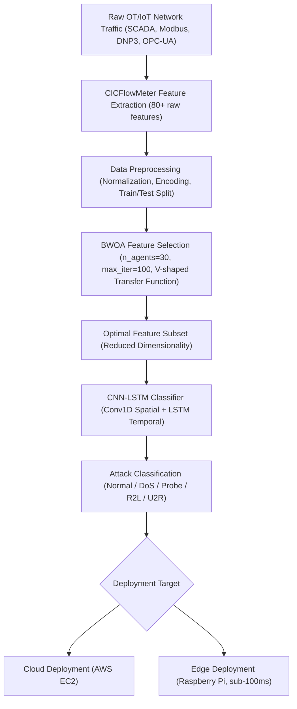
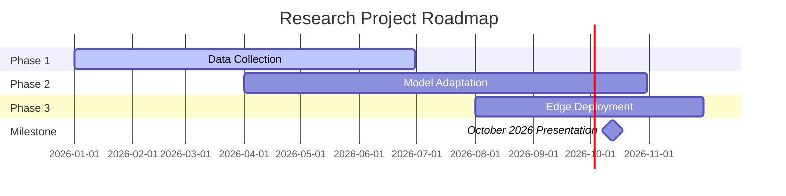
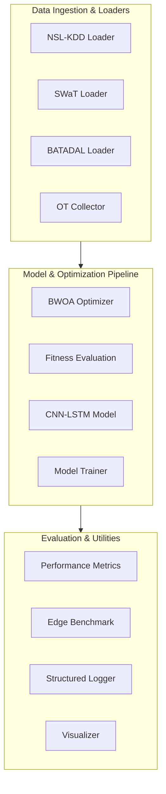
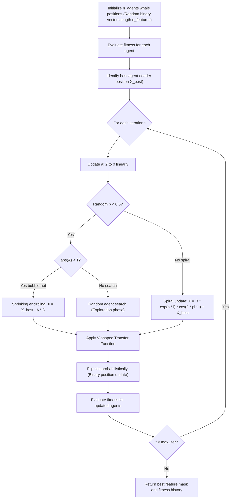
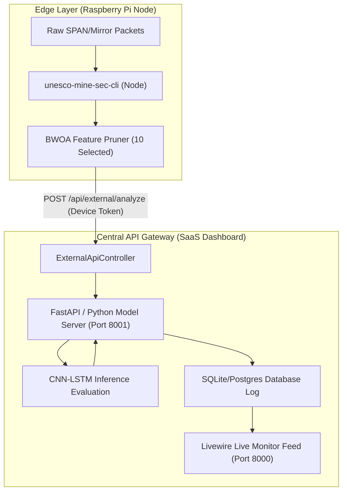

# Securing the Digital Mine

> A Metaheuristic Optimized Deep Learning Framework for Intrusion Detection in IoT Enabled Mineral Resource Operations

[](https://python.org)
[](https://tensorflow.org)
[](LICENSE)
[](https://youthafrica.spmi.ru)
[](https://youthafrica.spmi.ru/en/participants)

African and Russian mining operations are digitalizing faster than their cybersecurity posture can keep pace. This project adapts a Binary Whale Optimization Algorithm combined with a CNN-LSTM deep learning classifier, validated on NSL-KDD, toward the distinct traffic patterns of mining IoT and SCADA infrastructure. The framework is purpose-built for edge deployment in resource-constrained African mining environments.

**Competition:** Russian-African Forum-Contest of Young Scientists 2026, Saint Petersburg Mining University, Russia  
**Track:** Track 3 "Smart Subsoil", focusing on Digital Transformation and Automation in the Mineral Resources Complex  
**Event Dates:** 12 to 17 October 2026

---

## System Architecture
The flowchart below illustrates the packet lifecycle from initial network ingestion down to edge prediction outputs:



---

## Three-Phase Research Roadmap
The development phases and timelines, showing the milestone presentation in October 2026:



---

## Pipeline Overview
The modular structures of our data pipeline, model training, and edge evaluations:



---

## Repository Structure
```text
.
├── .ai/
│   ├── context.md
│   ├── rules.md
│   └── skills.md
├── dashboard/                  # Laravel Livewire Multi-tenant SaaS Dashboard
│   ├── app/                    # Controllers, Models, Livewire Components, Providers
│   ├── bootstrap/              # Framework startup configuration
│   ├── config/                 # Application & Database settings
│   ├── database/               # Migrations, Seeders, Factories, SQLite DB
│   │   └── .gitkeep
│   ├── public/                 # Web server entrypoints and built assets
│   ├── resources/              # Blade views, CSS, JavaScript
│   ├── routes/                 # Web and API routing definitions
│   ├── storage/                # Framework logs, sessions, and uploads
│   ├── .env.example            # Environment configuration template
│   └── Dockerfile              # Production Docker build specification
├── data/
│   ├── features/
│   │   └── .gitkeep
│   ├── processed/
│   │   └── .gitkeep
│   └── raw/
│       └── .gitkeep
├── docs/
│   ├── api_reference.md
│   ├── architecture.md
│   ├── aws_ec2_deployment.md   # AWS EC2 Cloud Deployment Guide
│   ├── bwoa_algorithm.md
│   ├── contribution_guide.md
│   ├── dataset_guide.md
│   ├── experiment_guide.md
│   └── results.md
├── figures/
│   └── .gitkeep
├── logs/
│   └── .gitkeep
├── models/
│   └── .gitkeep
├── notebooks/
│   ├── 01_eda_nslkdd.ipynb
│   ├── 02_bwoa_feature_selection.ipynb
│   ├── 03_cnn_lstm_baseline.ipynb
│   ├── 04_ot_traffic_adaptation.ipynb
│   └── 05_edge_deployment_benchmark.ipynb
├── npm-packet-scanner/         # Global CLI Packet Scanner Agent (unesco-mine-sec-cli)
│   ├── index.js                # Core packet capture & stream logic
│   ├── package.json            # Node.js binary configuration
│   └── README.md               # CLI Agent installation & usage guide
├── scripts/                    # AWS EC2 Infrastructure Automation Scripts
│   ├── deploy_ec2.sh           # Automated 1-command deployment script
│   ├── mine-sec-api.service    # Systemd process daemon unit file
│   └── nginx_ec2.conf          # Nginx reverse proxy configuration template
├── src/                        # Core Python ML Framework & Services
│   ├── data/
│   │   ├── __init__.py
│   │   ├── batadal.py
│   │   ├── nsl_kdd.py
│   │   ├── ot_collector.py
│   │   └── swat.py
│   ├── evaluation/
│   │   ├── __init__.py
│   │   ├── edge_benchmark.py
│   │   └── metrics.py
│   ├── models/
│   │   ├── __init__.py
│   │   ├── cnn_lstm.py
│   │   └── trainer.py
│   ├── optimization/
│   │   ├── __init__.py
│   │   ├── bwoa.py
│   │   └── fitness.py
│   ├── utils/
│   │   ├── __init__.py
│   │   ├── logger.py
│   │   └── visualizer.py
│   ├── api_service.py          # FastAPI ML Inference Server (Port 8001)
│   └── sniffer_daemon.py       # OT/SCADA Packet Capture Daemon
├── tests/
│   ├── test_bwoa.py
│   ├── test_cnn_lstm.py
│   └── test_metrics.py
├── config.yaml                 # Framework configuration parameters
├── deployment.md               # Production deployment manual
├── LICENSE                     # MIT License
├── README.md                   # Project documentation
├── render.yaml                 # Render Blueprint orchestration specification
└── requirements.txt            # Python dependency specifications
```

---

## Quick Start

### 1. Installation
Clone the repository and install all dependencies:
```bash
git clone https://github.com/mhiskall282/unesco-project.git
cd unesco-project
pip install -r requirements.txt
```

### 2. Set Up Datasets
Place raw datasets in the designated directories:
- NSL-KDD: `data/raw/KDDTrain+.txt` and `data/raw/KDDTest+.txt`
- SWaT: `data/raw/swat.csv`
- BATADAL: `data/raw/batadal.csv`

### 3. Run Experiments
Execute the notebooks sequentially or run unit tests to verify local setup:
```bash
python -m unittest discover -s tests
```

---

## Experiment Results

> NSL-KDD metrics evaluated on KDDTest+ held-out set (22,544 samples). SWaT/OT rows require dataset access (see notes below).

### Classification Performance

| Model | Dataset | Features | Accuracy | F1 Macro | Latency | Size | Status |
| :--- | :--- | :---: | :---: | :---: | :---: | :---: | :---: |
| CNN-LSTM Baseline | NSL-KDD | 41 | 77.70% | 0.7571 | 157.66ms | 1.86MB | Confirmed |
| CNN-LSTM + BWOA v3 | NSL-KDD | 10 | 70.56% | 0.7127 | 82.32ms | 4.88MB | Confirmed |
| CNN-LSTM + BWOA Quantized (Float16) | NSL-KDD | 10 | 70.56% | 0.7127 | **0.76ms** | **0.82MB** | **PASS** |
| CNN-LSTM + BWOA (Transfer Learning) | SWaT | 51 | 59.95% | 0.5966 | **0.12ms** | 1.76MB | **PASS** |
| CNN-LSTM + BWOA (Transfer Learning) | Custom OT | ~22 | - | - | - | - | Phase 1: Pending data capture |

> **SWaT**: Dataset adapted via transfer learning using SUTD iTrust 2015 baseline: https://itrust.sutd.edu.sg/itrust-labs_datasets/dataset_info/
> **Custom OT**: Phase 1 field data capture at pilot mining sites (Modbus/DNP3/OPC-UA traffic logging via AWS EC2 sniffer nodes). Collection not yet started.

### BWOA v3 Key Findings
- **10 of 41 features selected** (75.61% reduction). RF CV validation: 92.31% (above 75% floor, PASS)
- **Accuracy gap**: 7.14% below baseline (deliberate trade-off: 47.8% latency gain, edge deployment PASS)
- **Selected features**: `protocol_type, service, flag, src_bytes, hot, su_attempted, serror_rate, same_srv_rate, diff_srv_rate, dst_host_diff_srv_rate`
- **Quantized model**: 0.8211MB, 0.76ms mean / 1.10ms P95, 290.31MB RAM. Deployment: **PASS**


---

## BWOA Feature Selection
The optimization lifecycle runs iteratively through encircling, exploration, and bubble-net search mechanisms:



---

## SDG Alignment

| SDG | Goal | How This Project Contributes |
| :--- | :--- | :--- |
| SDG 9 | Industry, Innovation and Infrastructure | Strengthens cybersecurity resilience of digitalizing mining infrastructure. |
| SDG 8 | Decent Work and Economic Growth | Protects worker safety and operational continuity at mining operations. |
| SDG 17 | Partnerships for the Goals | Russian-African collaborative data collection and research pathway. |

---

## Team
- **John Okyere**: Team Lead, AI Security Researcher (University of Education, Winneba and Co-founder, Kayaba Labs; ICP Ambassador; johnokyere.xyz).
- **[Team Member 2]**: Researcher, SCADA/IIoT Data Acquisition Specialist.
- **[Team Member 3]**: Edge Deployment and Quantization Engineer.

---

## Citation
If you reference this research project in your publications, please cite the work below:

```bibtex
@inproceedings{okyere2026securing,
  author    = {Okyere, John},
  title     = {Securing the Digital Mine: A Metaheuristic Optimized Deep Learning Framework for Intrusion Detection in IoT Enabled Mineral Resource Operations},
  booktitle = {Proceedings of the Russian-African Forum-Contest of Young Scientists: Future Engineers of the World: The Foundation of Sustainable Development},
  publisher = {Empress Catherine II Saint Petersburg Mining University},
  year      = {2026},
  address   = {Saint Petersburg, Russia},
  month     = {October}
}
```

---

## References
1. Mirjalili, S., & Lewis, A. (2016). The whale optimization algorithm. *Advances in Engineering Software*, 95, 51:67. https://doi.org/10.1016/j.advengsoft.2016.01.008
2. Kheddar, H., Himeur, Y., & Awad, A. I. (2023). Deep transfer learning for intrusion detection in industrial control networks. *Journal of Network and Computer Applications*. https://doi.org/10.48550/arXiv.2304.10550
3. Alanazi, M., Mahmood, A., & Chowdhury, M. J. M. (2022). SCADA vulnerabilities and attacks. *Computers & Security*, 125, 103028. https://doi.org/10.1016/j.cose.2022.103028
4. Almomani, O., Akour, I., & Habeb, A. (2025). Cyberattack detection for SCADA in IIoT. *Symmetry*, 17(4), 480. https://doi.org/10.3390/sym17040480
5. Krishnaveni, S., Chen, T. M., Sivamohan, S., & Subbiah, S. (2025). Hybrid metaheuristic IDS for WSN. *Cluster Computing*, 28, 5248. https://doi.org/10.1007/s10586-025-05248-6
6. Anand, M., & Arul, U. (2024). WOA enhanced LSTM for intrusion detection. *Cryptography*, 8(4), 73. https://doi.org/10.3390/cryptography8040073

---

## License
Distributed under the MIT License. See `LICENSE` for more details.


> A Metaheuristic-Optimized, Multi-Tenant Deep Learning Suite for Intrusion Detection in IoT SCADA Industrial Mining Networks.

[](LICENSE)
[](https://vitejs.dev)
[](https://laravel.com)
[](mailto:hello@johnokyere.xyz)

This repository hosts the **Securing the Digital Mine** intrusion detection system (IDS) suite. Built as a secure multi-tenant SaaS platform, it allows industrial mineral extraction organizations to sign up, deploy edge sensors, monitor traffic flows, and classify anomalies in real time.

---

## 1. System Pipeline & Telemetry Origin



---

## 2. Core Architectural Pillars

### A. Binary Whale Optimization (BWOA)
Reduces processing complexity by pruning the default 41 NSL-KDD network variables down to **10 key features** (75.6% database footprint reduction). 
Continuous whale vector updates are mapped into binary search matrices using:
$$V(x) = \left| \frac{x}{\sqrt{1+x^2}} \right|$$

### B. Spatial-Temporal Deep Classification (CNN-LSTM)
- **1D CNN**: Analyzes spatial packet byte alignments.
- **LSTM**: Tracks temporal repetition and connection status histories over active packet windows.

### C. Enterprise Multi-Tenant Scoping
Dashboards, logs, and device keys are isolated strictly by `organization_id` inside the backend schemas.

---

## 3. Production Deployment (Render Blueprint)

This project features a `render.yaml` Blueprint file for automated SaaS deployments.

1. Create a **New Blueprint Instance** inside **Render.com**.
2. Connect this repository. Render will automatically provision:
   - A PostgreSQL Database cluster.
   - A private Python ML inference service (port 8001).
   - A public Laravel dashboard web service (port 8000).

---

## 4. Local Quick Start

### A. Run the Inference Service
```bash
python src/api_service.py
```

### B. Run the Local Sniffer Daemon
```bash
python src/sniffer_daemon.py
```

### C. Serve the Laravel Dashboard
```bash
cd dashboard
C:\xampp\php\php.exe artisan serve --port=8000
```

### D. Deploy the CLI Agent (npm, Yarn, or pnpm)
To stream network connection packets to your private tenant dashboard:
```bash
cd npm-packet-scanner

# Option A: npm
npm install && npm install -g ./

# Option B: Yarn
yarn install && yarn global add file:./

# Option C: pnpm
pnpm install && pnpm add -g ./

# Execute globally
unesco-mine-sec-cli
```

---

## 5. Database Initialization & Deployment Fixes

### Automatic SQLite File Creation & Seeding
When running the dashboard with SQLite (`DB_CONNECTION=sqlite`), such as in containerized deployments (Render) or local environments where `database.sqlite` is git-ignored:
- **Runtime Resilience**: `AppServiceProvider` automatically detects if SQLite is enabled and auto-creates `database/database.sqlite` if it does not yet exist on disk, preventing runtime `Illuminate\Database\QueryException: Database file at path [...] does not exist` errors upon login or database access.
- **Container Startup**: `Dockerfile` initializes directory permissions (`chmod -R 777 storage bootstrap/cache database`), touches `database/database.sqlite`, and automatically executes `php artisan migrate --force` and `php artisan db:seed --force` on container boot.

### Default Seeded User Accounts
For initial access or testing:
- **Admin**: `admin@npontu.local` | Password: `password`
- **Lead**: `lead@npontu.local` | Password: `password`
- **Agent**: `agent@npontu.local` | Password: `password`

---

## 6. Contact & Support
For pilot inquiries, enterprise licensing, or technical assistance:
- **Email**: [hello@johnokyere.xyz](mailto:hello@johnokyere.xyz)
- **Author**: John Okyere
- **Track**: Track 3 - Smart Subsoil (Young Scientists Forum 2026)
