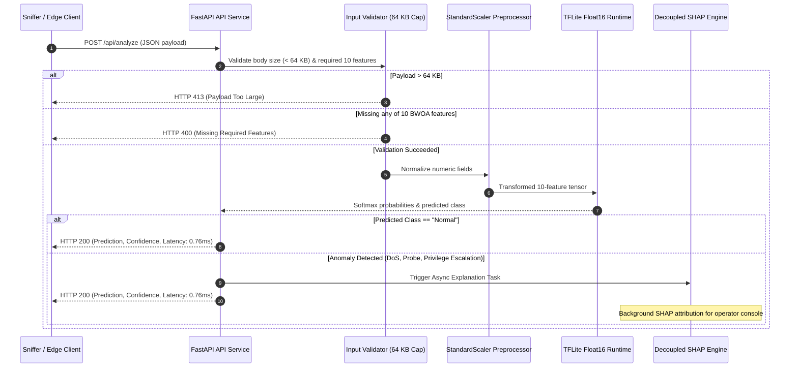

# API Reference Documentation

This document provides a programming reference for classes, functions, and modules inside the `src/` folder.

---

## 1. Optimization Package (`src/optimization/`)

### `BinaryWhaleOptimizer`
`from src.optimization.bwoa import BinaryWhaleOptimizer`

A candidate feature search wrapper based on whale hunting mechanics, adapted for discrete spaces.

#### Methods
* `__init__(n_agents: int, n_features: int, max_iter: int, fitness_fn: Callable, b: float = 1.0)`: Initializes search spaces and agent populations.
* `optimize(X_train: np.ndarray, y_train: np.ndarray, X_val: np.ndarray, y_val: np.ndarray) -> Tuple[np.ndarray, List[float]]`: Runs search loops and returns (best_mask, fitness_history).
* `_transfer_function(v: np.ndarray) -> np.ndarray`: V-shaped transfer function mapping continuous steps to probability arrays.

---

### `FeatureFitnessEvaluator`
`from src.optimization.fitness import FeatureFitnessEvaluator`

Computes feature selection quality with an accuracy floor constraint.

#### Methods
* `__init__(alpha: float = 0.3, min_accuracy: float = 0.75, min_features: int = 10)`: Initializes weight constraints (30% feature ratio penalty, 70% error rate penalty, with a 75% accuracy floor).
* `calculate_fitness(features_mask: np.ndarray, X_train: np.ndarray, y_train: np.ndarray, X_val: np.ndarray, y_val: np.ndarray) -> float`: Evaluates candidate feature mask quality via stratified 3-fold cross validation.

---

## 2. Models Package (`src/models/`)

### `build_cnn_lstm`
`from src.models.cnn_lstm import build_cnn_lstm`

```python
def build_cnn_lstm(
    input_shape: Tuple[int, int],
    n_classes: int,
    filters: int = 64,
    kernel_size: int = 3,
    lstm_units: int = 128,
    dropout_rate: float = 0.3
) -> tf.keras.Model:
```
Assembles Conv1D spatial extractor and LSTM temporal sequence blocks. Returns compiled Keras neural network.

---

### `build_cnn_lstm_v4`
`from src.models.cnn_lstm import build_cnn_lstm_v4`

```python
def build_cnn_lstm_v4(
    input_shape: Tuple[int, int],
    n_classes: int,
    filters: int = 64,
    kernel_size: int = 3,
    lstm_units: int = 256,
    dropout_rate: float = 0.3,
    l2_reg: float = 1e-4
) -> tf.keras.Model:
```
Strengthened variant with self-attention mechanism, stacked LSTM sequence layers, and L2 kernel regularization.

---

### `build_cnn_lstm_with_attention`
`from src.models.cnn_lstm import build_cnn_lstm_with_attention`

```python
def build_cnn_lstm_with_attention(
    input_shape: Tuple[int, int],
    n_classes: int,
    filters: int = 64,
    kernel_size: int = 3,
    lstm_units: int = 128,
    dropout_rate: float = 0.3
) -> tf.keras.Model:
```
CNN-LSTM architecture with dot-product temporal attention layer for enhanced feature saliency weighting.

---

### `ModelTrainer`
`from src.models.trainer import ModelTrainer`

Orchestrates backpropagation optimization runs.

#### Methods
* `__init__(config: Dict[str, Any])`: Configures learning rates and file saving paths.
* `train(model: tf.keras.Model, X_train: np.ndarray, y_train: np.ndarray, X_val: np.ndarray, y_val: np.ndarray) -> tf.keras.callbacks.History`: Executes model fits.

---

## 3. Data Loaders (`src/data/`)

### `NSLKDDLoader`
Loads and maps NSL-KDD data structures.

#### Methods
* `load(path: str) -> pd.DataFrame`: Ingests raw data.
* `preprocess(df: pd.DataFrame) -> Tuple[np.ndarray, np.ndarray]`: Cleans and encodes classes.
* `train_test_split(X: np.ndarray, y: np.ndarray, test_size: float = 0.2)`: Splits data.
* `normalize(X_train: np.ndarray, X_test: np.ndarray)`: Scales values.

---

### `SWaTLoader` and `BATADALLoader`
`from src.data.swat import SWaTLoader`  
`from src.data.batadal import BATADALLoader`

Loaders for SWaT and BATADAL industrial datasets. `SWaTLoader` features include:
* `load(path: str) -> pd.DataFrame`: Ingests CSV, structured Excel (.xlsx), or numpy (.npy) formats. Auto-generates a high-fidelity synthetic mock if file is missing.
* `load_combined(normal_path: str, attack_path: str) -> pd.DataFrame`: Combines separate normal and attack run data.
* `preprocess(df: pd.DataFrame, return_timestamps: bool, apply_spectral_residual: bool) -> Tuple`: Cleans, drops timestamps, coerces numeric columns, and handles standard label typologies.
* `train_test_split_temporal(X: np.ndarray, y: np.ndarray, train_ratio: float)`: Time-ordered split preserving sequential sensor telemetry.
* `sliding_window(X: np.ndarray, y: np.ndarray, window_size: int, stride: int)`: Generates sequence window tensors for CNN-LSTM inputs.
* `normalize(X_train: np.ndarray, X_test: np.ndarray, method: str)`: Normalizes using MinMax (preferred) or Standard scalers.
* `_spectral_residual(X: np.ndarray, smooth_window: int)`: Saliency-based spectral residual transform to remove periodic normal patterns.

---

### `SWaTTransferLearner`
`from src.models.swat_transfer import SWaTTransferLearner`

Adapts a pre-trained IT network intrusion detector (NSL-KDD baseline) to the SWaT industrial sensor space.
* `__init__(n_swat_features: int, window_size: int, pretrained_model_path: str, freeze_cnn_blocks: bool, learning_rate: float)`: Configures transfer settings.
* `build_transfer_model() -> tf.keras.Model`: Loads pre-trained `.h5` layers, adapts input dimensions (from 41 to 51 features), copies compatible weights, and optionally freezes CNN layers.
* `fine_tune(model, X_train, y_train, X_val, y_val, epochs, batch_size, patience, save_path)`: Retrains the LSTM and Dense layers using class weights for imbalance.
* `find_optimal_threshold(model, X_val, y_val) -> Tuple[float, float]`: Searches for decision threshold maximizing F1 Macro score.
* `evaluate(model, X_test, y_test, threshold) -> Dict[str, Any]`: Evaluates temporal test splits for accuracy, precision, recall, macro F1, and AUC-ROC.

---

### `OTTrafficCollector`
Manages packet captures and CICFlowMeter logs.

#### Methods
* `configure(interface: str, output_dir: str, cicflowmeter_path: str)`: Configures paths.
* `capture(duration_seconds: int) -> str`: Captures flows.
* `align_features_to_nslkdd(df: pd.DataFrame) -> pd.DataFrame`: Maps columns to standard baseline shapes.

---

## 4. Evaluation and Benchmarks (`src/evaluation/`)

### `ExperimentMetrics`
Calculates precision, recall, confusion matrix, ROC-AUC, and latency profiles.

#### Methods
* `compute(y_true: np.ndarray, y_pred: np.ndarray, y_prob: Optional[np.ndarray] = None) -> Dict[str, Any]`: Computes metrics.
* `latency_profile(model, X_sample: np.ndarray, n_runs: int = 100) -> Dict[str, float]`: Computes latencies.
* `to_json(metrics_dict: Dict[str, Any], path: str)`: Dumps to JSON files.

---

### `EdgeBenchmark`
Checks edge hardware compatibility and handles quantization.

#### Methods
* `load_model(model_path: str)`: Ingests saved models.
* `benchmark_latency(X_sample: np.ndarray, num_runs: int = 100) -> Dict[str, float]`: Evaluates inference latency.
* `benchmark_memory() -> Dict[str, float]`: Evaluates RAM allocation size.
* `quantize_model(model: tf.keras.Model, quantization_type: str = "float16") -> str`: Creates TFLite files.
* `check_deployment_readiness(latency_dict: Dict[str, float], memory_dict: Dict[str, float]) -> Tuple[bool, str]`: Evaluates readiness.

---

## 5. Microservices & Daemons (`src/`)

### `ModelInferenceHandler` (`src/api_service.py`)
FastAPI / HTTP server handling TFLite Float16 inference evaluations.



#### Endpoints
* `GET /api/health`: Returns model health (`status`: `"healthy"` or `"degraded"`), readiness (`model_ready`: `true`/`false`), model version (`v3.0.0-tflite-quantized`), and runtime framework status.
* `GET /api/features`: Returns the 10 BWOA-selected feature names (`selected_features`), their indices in the 41-feature NSL-KDD vector, and the feature reduction percentage (75.61%).
* `POST /api/analyze`: Accepts a JSON payload containing all 10 BWOA-selected network telemetry features (`protocol_type`, `service`, `flag`, `src_bytes`, `hot`, `su_attempted`, `serror_rate`, `same_srv_rate`, `diff_srv_rate`, `dst_host_diff_srv_rate`).

  **Request Validation**:
  - Maximum body size: 64 KB (returns HTTP 413 `Request body too large` if exceeded).
  - Body must be a JSON object (returns HTTP 400 if invalid).
  - All 10 BWOA-selected features must be present. Missing fields return HTTP 400 with a list of `missing_features` (missing fields are not silently defaulted to zero to prevent false-positive DoS predictions).

  **Response Format**:
  ```json
  {
    "prediction": "Normal|DoS|Probe|U2R|R2L",
    "confidence": 97.5,
    "class_probabilities": {
      "DoS": 97.5,
      "Normal": 1.8,
      "Probe": 0.4,
      "R2L": 0.2,
      "U2R": 0.1
    },
    "features_used": [
      "protocol_type", "service", "flag", "src_bytes", "hot",
      "su_attempted", "serror_rate", "same_srv_rate", "diff_srv_rate", "dst_host_diff_srv_rate"
    ],
    "latency_ms": 0.76,
    "model_version": "v3.0.0-tflite-quantized"
  }
  ```

* `GET /api/shap/summary`: Returns the empirical SHAP attribution benchmarks, BWOA vs TreeSHAP comparisons, and exact CPU execution latency from the IBA Karachi collaboration.
* `POST /api/explain`: Evaluates a 10-feature telemetry payload and immediately attaches decoupled plain-language SHAP explanations and recommended operator mitigation actions:

  **Sample Response**:
  ```json
  {
    "prediction": "DoS",
    "confidence": 99.2,
    "latency_ms": 0.76,
    "explanation": {
      "status": "anomaly_flagged",
      "predicted_class": "DoS",
      "confidence": 99.2,
      "base_prior": 0.36,
      "summary": "Alert: DoS attack detected with 99.2% confidence. Primary triggers: flag=S0 (+0.31), serror_rate=1.0 (+0.31). Raised DoS probability from baseline 0.36 to 0.99.",
      "top_drivers": [
        {"feature": "serror_rate", "value": "1.0", "shap_value": 0.311},
        {"feature": "flag", "value": "S0", "shap_value": 0.308},
        {"feature": "same_srv_rate", "value": "1.0", "shap_value": 0.089}
      ],
      "recommended_action": "Inspect PLC network saturation. Verify whether Modbus cyclic polling or SYN-flood was targeted at SAG mill cooling RTU.",
      "execution_mode": "asynchronous_decoupled",
      "benchmark_reference": "KernelSHAP (1,024 exact coalitions, 50 centroids; Uddin & Iradat 2026)"
    }
  }
  ```

### `SnifferDaemon` (`src/sniffer_daemon.py`)
OT/SCADA Promiscuous Network Sniffer Daemon.

#### Execution Modes
* Continuous Live Daemon: `python src/sniffer_daemon.py`
* Intermittent Cron Pass: `python src/sniffer_daemon.py --cron`

---

## 6. Dashboard External REST API (`dashboard/app/Http/Controllers/Api/ExternalApiController.php`)

### Device Authentication & Flow Telemetry Ingestion
* `POST /api/external/analyze`
  - **Headers**: `X-Device-Token: <api_token>`
  - **Body**:
    ```json
    {
      "protocol_type": "tcp",
      "service": "http",
      "flag": "SF",
      "src_bytes": 1024,
      "hot": 0,
      "su_attempted": 0,
      "serror_rate": 0.0,
      "same_srv_rate": 1.0,
      "diff_srv_rate": 0.0,
      "dst_host_diff_srv_rate": 0.0
    }
    ```
  - **Functionality**: Validates device token against `devices` table, forwards payload to `MODEL_SERVER_URL` (`http://api-service-prod:8001/api/analyze`), records flow telemetry to `live_network_flows` table under the device's `organization_id`, and triggers real-time Livewire event broadcast.

---

## 7. Edge Telemetry CLI Agent (`@mhiskall282/unesco-mine-sec-cli`)

A Node.js edge network sniffer distributed via [GitHub Packages](https://github.com/mhiskall282/Securing-the-Digital-Mine-UNESCO-Project/pkgs/npm/unesco-mine-sec-cli).

### Installation & Execution
```bash
# Configure GitHub Packages registry for @mhiskall282 scope
npm config set @mhiskall282:registry https://npm.pkg.github.com

# Run directly via npx
npx @mhiskall282/unesco-mine-sec-cli

# Or install globally
npm install -g @mhiskall282/unesco-mine-sec-cli
unesco-mine-sec-cli
```

### CLI Command Options
* `--url <api_endpoint>`: Target API endpoint URL (default: `https://minesec-dashboard-prod.onrender.com/api/external/analyze`).
* `--key <bearer_token>`: Device Bearer Token for organization-scoped telemetry ingestion.
* `--interface <adapter>`: Network interface to bind and sniff.
* `--help` / `-h`: Displays the interactive help menu.
* `--version` / `-v`: Displays CLI version information.

See [`npm-packet-scanner/README.md`](../npm-packet-scanner/README.md) for full guide and documentation.
