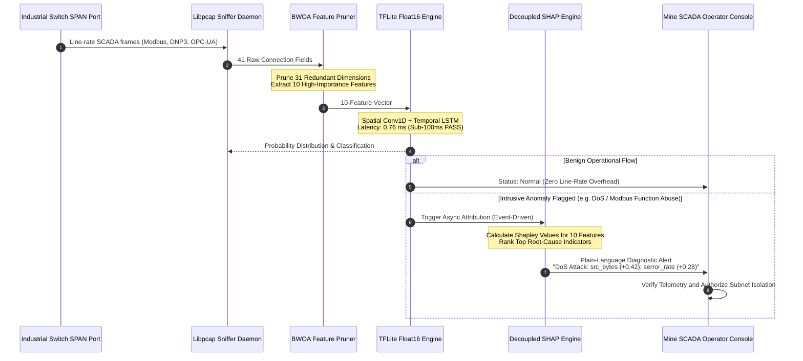
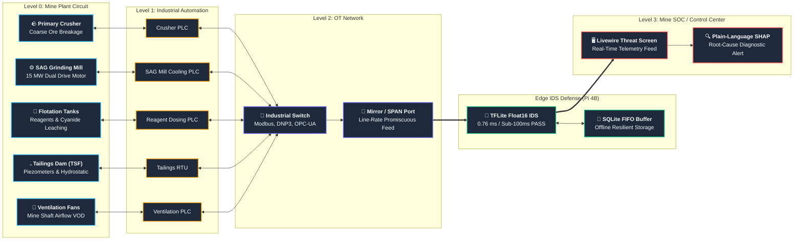
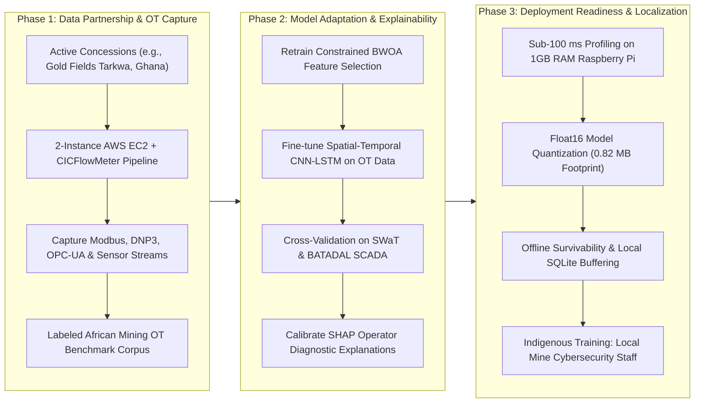

# System Architecture and Methodology: Securing the Digital Mine
## An Explainable, Metaheuristic-Optimized Deep Learning Framework for Intrusion Detection in IoT-Enabled Mineral Resource Operations

**Nomination**: Track 3, "Smart Subsoil": Digital Transformation and Automation in the Mineral Resources Complex  
**Forum**: Russian-African Forum of Young Scientists: "Future Engineers of the World - The Foundation of Sustainable Development", Empress Catherine II Saint Petersburg Mining University, under the auspices of the UNESCO International Centre of Competence in Mining Engineering Education.  

---

## Executive Summary & Scientific Proposal

### Problem Statement
African mining operations are digitalizing quickly through IoT sensor networks, SCADA systems, and cloud-connected digital twins (e.g., Gold Fields' Tarkwa mine in Ghana), yet cybersecurity for these operational technology (OT) environments lags behind conventional IT (Alanazi, Mahmood, & Chowdhury, 2022). Industrial control protocols (Modbus RTU/TCP, DNP3, OPC-UA) lack authentication, encryption, or sequence verification. Compromising these networks allows adversaries to manipulate PLCs, halt milling production ($25,000 to $50,000/hr downtime), or trigger catastrophic kinetic disasters such as tailings dam overflows or ventilation failure in underground shafts (African Mining Market, 2024; IT-Online, 2026).

### Main Scientific Hypothesis
A Binary Whale Optimization Algorithm (BWOA) combined with a spatial-temporal CNN-LSTM deep learning detector, validated on generic network traffic, can be systematically retrained and adapted to the structural characteristics of mining IoT and SCADA traffic (deterministic polling intervals, industrial protocol fields, and narrow attack classes; Kheddar et al., 2023). Attaching a decoupled SHAP (SHapley Additive exPlanations) layer provides non-specialist control room operators with transparent, plain-language root-cause reasons for each flagged alert without delaying line-rate packet evaluation (Oyedotun, Oise, & Ozobialu, 2025).

---

## 1. 4-Tier Edge Defense Architecture

The framework is organized into four decoupled tiers, ensuring zero inline network latency and offline survivability:

```mermaid
flowchart LR
    subgraph Tier1["Tier 1: Line Ingestion"]
        direction TB
        SPAN["📡 <b>SCADA Mirror Port</b><br/>Zero In-Line Latency"]
        SNIFF["📥 <b>Libpcap Daemon</b><br/>Promiscuous Packet Capture"]
        SPAN --> SNIFF
    end

    subgraph Tier2["Tier 2: BWOA Optimization"]
        direction TB
        RAW["📊 <b>Raw Vector</b><br/>41 Telemetry Dimensions"]
        BWOA["⚡ <b>BWOA Pruner</b><br/>10 High-Value Features"]
        MASK["🎯 <b>75.61% Reduction</b><br/>Executed in <0.05 ms"]
        RAW --> BWOA --> MASK
    end

    subgraph Tier3["Tier 3: Spatial-Temporal Engine"]
        direction TB
        CONV["🔬 <b>1D CNN Layer</b><br/>Spatial Packet Correlation"]
        LSTM["⏱️ <b>LSTM Units (64)</b><br/>Temporal Sequence Memory"]
        TFLITE["🧠 <b>Float16 TFLite</b><br/>0.76 ms / 0.82 MB Size"]
        CONV --> LSTM --> TFLITE
    end

    subgraph Tier4["Tier 4: Supervisory & SHAP"]
        direction TB
        GATE{"Alert Gate"}
        PASS["✅ <b>Normal Baseline</b><br/>Logged (<0.8 ms)"]
        SHAP["🔍 <b>Decoupled SHAP</b><br/>Async Explainability"]
        UI["🖥️ <b>SCADA Console</b><br/>Plain-Language Alerts"]
        GATE -- "Normal" --> PASS
        GATE -- "Intrusion" --> SHAP --> UI
    end

    SNIFF ==> RAW
    MASK ==> CONV
    TFLITE ==> GATE

    classDef t1 fill:#1e293b,stroke:#38bdf8,stroke-width:2px,color:#f8fafc;
    classDef t2 fill:#1e293b,stroke:#f59e0b,stroke-width:2px,color:#f8fafc;
    classDef t3 fill:#1e293b,stroke:#10b981,stroke-width:2px,color:#f8fafc;
    classDef t4 fill:#1e293b,stroke:#ef4444,stroke-width:2px,color:#f8fafc;

    class SPAN,SNIFF t1;
    class RAW,BWOA,MASK t2;
    class CONV,LSTM,TFLITE t3;
    class GATE,PASS,SHAP,UI t4;
```

---

## 2. Decoupled Explainable AI (SHAP) Lifecycle

In mineral extraction operations, deep learning predictions must be explainable so that shift supervisors can verify alerts before shutting down heavy machinery. To respect the sub-100 ms SCADA control loop deadline, SHAP is executed asynchronously on flagged events:

---

## 3. Cyber-Physical Mine Topology & Defense Boundary

The diagram below maps the physical mineral extraction circuit to the operational technology network and edge intrusion detection boundary:

---

## 4. Three-Phase Implementation Roadmap

The research roadmap transitions the framework from academic benchmarks into live operational environments across Africa:

### Phase 1: Data Partnership & Ingestion
Capture real-world OT traffic at pilot mining concessions (e.g., Gold Fields Tarkwa mine, Ghana) and academic testbeds. Deploy a dual-instance AWS EC2 and CICFlowMeter setup to generate labeled benign and attack traffic for industrial SCADA protocols (Modbus RTU/TCP, DNP3, OPC-UA) and IoT sensor telemetry.

### Phase 2: Model Adaptation & Explainability
Retrain constrained BWOA and spatial-temporal CNN-LSTM models directly on domain-specific OT feature sets (Kheddar et al., 2023). Cross-validate on the physical 51-sensor SWaT and BATADAL cyber-physical benchmarks. Attach the SHAP explanation layer to generate plain-language feature attributions for non-specialist operators (Oyedotun et al., 2025).

### Phase 3: Deployment Readiness & Localization
Profile latency and compute envelopes under strict edge constraints, guaranteeing sub-100 ms response times on Raspberry Pi hardware (with decoupled SHAP execution). Train local mine technicians and cybersecurity personnel to build sovereign African technical capacity rather than transferring opaque foreign tools.

---

## 5. Alignment with United Nations Sustainable Development Goals

| SDG | Goal Target | Project Contribution |
| :--- | :--- | :--- |
| **SDG 9** | Industry, Innovation, and Infrastructure | Strengthens cybersecurity resilience and sovereignty for digitalizing African mining infrastructure. |
| **SDG 8** | Decent Work and Economic Growth | Safeguards worker lives and operational continuity by shielding ventilation grids and tailings dam monitors from kinetic cyber sabotage. |
| **SDG 17** | Partnerships for the Goals | Bilateral young-scientist research pathway uniting the University of Education, Winneba (Ghana) and Empress Catherine II Saint Petersburg Mining University (Russia). |
