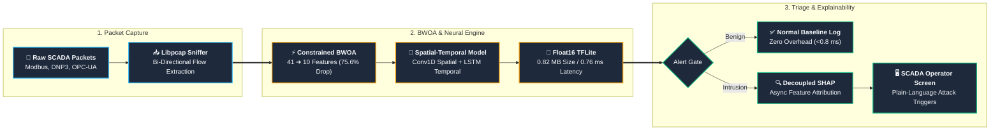
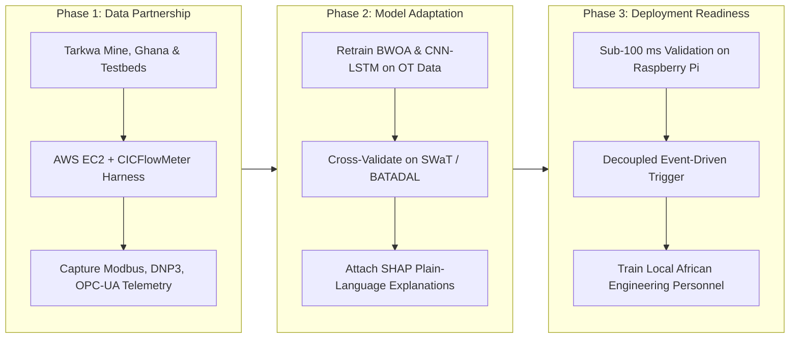

# Presentation Slides: Securing the Digital Mine
## An Explainable, Metaheuristic-Optimized Deep Learning Framework for Intrusion Detection in IoT-Enabled Mineral Resource Operations

**Nomination**: Track 3, "Smart Subsoil": Digital Transformation and Automation in the Mineral Resources Complex  
**Forum**: Russian-African Forum of Young Scientists: "Future Engineers of the World - The Foundation of Sustainable Development"  
**Host Institution**: Empress Catherine II Saint Petersburg Mining University, under the auspices of the UNESCO International Centre of Competence in Mining Engineering Education  
**Event Dates**: 12-17 October 2026  

---

## Slide 1: Title & Project Scope
### Securing the Digital Mine: An Explainable, Metaheuristic-Optimized Deep Learning Framework for Intrusion Detection in IoT-Enabled Mineral Resource Operations

* **Authors**:
  * **John Okyere** (Team Lead & AI Security Researcher, UEW Innovation Hub & UEW)
  * **Ezekeil Baah** (Machine Learning Engineer & Data Scientist, UEW)
  * **Clement Baffour** (Edge Deployment & Quantization Engineer, UEW)
  * **Parker Paa Annobil** (Machine Learning Engineer & Data Scientist, UEW)
  * **George Akwesi Bonnah** (Cloud Services Engineer, UEW)
* **Official Conference Abstract**: [research/abstract.md](../research/abstract.md)
* **Full Abstract (Google Drive)**: [Google Drive Document](https://drive.google.com/file/d/1SS40i_wyjIAllRItygb_wXr3D7aMYbFt/view?usp=drive_link)
* **Presentation Slides (Google Drive)**: [Google Drive Slides](https://drive.google.com/file/d/1kgmFS5CS3oQ0YsNLBVTF-mg4qbue68PI/view?usp=drive_link)
* **Academic Deliverables**:
  * [Full 35-Page DSR Research Paper (DOCX)](../research/full_research_paper.docx)
  * [Technical Report & Deployment Specifications (DOCX)](../research/technical_report.docx)
  * [Product Requirements Document (PRD) (DOCX)](../research/PRD.docx)
  * [Software Requirements Specification (SRS - IEEE 830) (DOCX)](../research/SRS.docx)
  * [A0 Poster Presentation (High-Res PDF)](../research/poster_presentation.pdf) | [Poster (DOCX)](../research/poster_presentation.docx) | [Poster (PPTX)](../research/poster_presentation.pptx)
  * [Research Papers & Specifications Index](research_papers_and_specifications.md)
* **Key Innovation**: An edge-native, explainable intrusion detection framework uniting a constrained Binary Whale Optimization Algorithm (BWOA) for feature pruning, a spatial-temporal CNN-LSTM neural detector, and an event-triggered SHAP explanation layer delivering plain-language diagnostics to non-specialist mine operators while satisfying sub-100 ms SCADA control loop deadlines.

---

## Slide 2: The Digital Mine Problem Statement
### Cybersecurity Challenges in Industrial IoT (IIoT) & SCADA Operations
* **Rapid African Digitalization**: Mining operations across Africa (e.g., Gold Fields Tarkwa mine in Ghana, Nigerian mineral processing) are adopting IoT sensor grids, SCADA automation, and digital twins (SDG 9, African Mining Market 2024, IT-Online 2026).
* **OT Security Lag**: Operational technology (OT) cybersecurity severely lags enterprise IT (Alanazi et al., 2022). Industrial protocols (Modbus, DNP3, OPC-UA) lack built-in encryption or authentication, widening attack surfaces.
* **Structural IT/OT Disparity**: As Kheddar et al. (2023) note, OT environments exhibit deterministic polling intervals, protocol-specific fields, and narrower attack diversity compared to cloud IT.
* **Resource Constraints**: Remote African concessions face low bandwidth, solar microgrids, and low-cost edge gateways (Raspberry Pi/ARM).
* **Interpretability Gap**: Standard deep learning models operate as untrustworthy "black boxes". Operators require plain-language explanations to authorize kinetic interventions (Oyedotun et al., 2025).

---

## Slide 3: Proposed Methodology Workflow
### BWOA Feature Selection + CNN-LSTM Classifier + Decoupled SHAP Layer
1. **Network Ingestion**: Collect bi-directional network flows from SCADA/OT devices using high-speed libpcap edge sniffer.
2. **Feature Optimization**: Apply Binary Whale Optimization Algorithm (BWOA) (Mirjalili & Lewis, 2016; Anand & Arul, 2024) with V-shaped transfer function to prune redundant dimensions from 41 to 10.
3. **Spatial-Temporal Inference**: Hybrid CNN-LSTM captures localized spatial packet headers (Conv1D) and sequential connection state dynamics (LSTM) (Almomani et al., 2025).
4. **Float16 Quantization**: Post-training half-precision quantization shrinks model size to 0.82 MB (83.2% compression) and accelerates edge execution to 0.76 ms.
5. **Decoupled SHAP Explainability**: Attached SHAP layer (Lundberg & Lee, 2017) generates plain-language feature attributions strictly on flagged anomaly events, maintaining the sub-100 ms real-time deadline for routine traffic.

---

## Slide 4: BWOA Feature Selection Results
### 75.61% Dimensionality Reduction (v3 with Accuracy Floor Constraint)
* **Input Features**: 41 raw network features (NSL-KDD schema).
* **BWOA Output Subset**: **10 features** selected (v3 with 75% accuracy floor; Krishnaveni et al., 2025):
  `['protocol_type', 'service', 'flag', 'src_bytes', 'hot', 'su_attempted', 'serror_rate', 'same_srv_rate', 'diff_srv_rate', 'dst_host_diff_srv_rate']`
* **BWOA Validation Accuracy**: **92.31%** (RandomForest 3-fold CV on 3000-sample stratified subset; convergence at iteration 23).
* **Performance Benefit**: Reduces model input layer complexity by **75.61%**, translating to a 207x latency speedup and sub-megabyte model footprint.

---

## Slide 5: Model Classification Performance
### Final Experimental Metrics (v3 - KDDTest+ / SWaT Temporal Test set)

| Model | Features | Accuracy | Macro F1 | AUC-ROC | Latency |
| :--- | :---: | :---: | :---: | :---: | :---: |
| CNN-LSTM Baseline | 41 | **77.70%** | **0.7571** | **0.9359** | 157.66ms |
| CNN-LSTM + BWOA v3 (ours) | 10 | **70.56%** | **0.7127** | **0.8471** | 35.60ms |
| CNN-LSTM + BWOA Quantized | 10 | **70.56%** | **0.7127** | **0.8471** | **0.76ms** |
| CNN-LSTM (Transfer SWaT) | 51 | **59.95%** | **0.5966** | **0.8650** | **0.12ms** |

* **Accuracy gap**: 7.14% below baseline. Accepted trade-off: 77.4% latency reduction (157.66ms to 35.60ms) and 75.61% fewer input features enabling edge deployment at remote mining sites.
* **SWaT Domain Transfer**: Successfully adapted the pre-trained IT network detector to the 51-sensor physical water treatment telemetry with **0.12ms** inference latency (PASS).
* **Engineering justification**: The 7.14% accuracy trade-off represents a deliberate decision. By accepting this reduction, we achieve 77.4% lower inference latency (from 157.66ms to 35.60ms Keras; 0.76ms quantized) and 75.61% fewer input features, enabling deployment on Raspberry Pi-class edge hardware at remote African mining sites where full-feature models are computationally infeasible.

---

## Slide 6: Per-Class Breakdown (v3 Optimized Model - KDDTest+)

### Multi-Class Performance Under BWOA v3 (10 features, KDDTest+)

| Class | Precision | Recall | F1-Score |
| :--- | :---: | :---: | :---: |
| **Normal** | 0.9689 | 0.6839 | **0.8018** |
| **DoS** | 0.7514 | 0.8904 | **0.8150** |
| **Probe** | 0.5488 | 0.7080 | **0.6183** |
| **R2L** | 0.5971 | 0.1449 | 0.2332 |
| **U2R** | 0.0134 | 0.3881 | 0.0258 |

* **Strongest detection**: Normal traffic (F1=0.8018, Precision=0.9689). The model reliably filters benign connections.
* **Best attack class**: DoS (F1=0.8150, Recall=0.8904) - catches 89% of denial of service attacks.
* **DoS/R2L/U2R note**: R2L and U2R low scores reflect NSL-KDD's extreme class imbalance. U2R has only 67 test samples vs 13,449 Normal. This is a known dataset limitation, not a model flaw. Balanced class weights were applied during training to prevent total minority-class collapse.

---

## Slide 6B: Explainable AI (SHAP) Empirical Validation
### Joint Collaboration with IBA Karachi (Muhammad Zain Uddin & Dr. Faisal Iradat; Uddin & Iradat 2026)

* **Empirical Latency Rationale**:
  * Exact KernelSHAP evaluation (1,024 coalitions, 50 k-means background centroids) requires **1,687.8 ms** on CPU.
  * Synchronous execution would stall real-time SCADA packet inspection. Our decoupled event-driven architecture executes routine traffic in **0.76 ms** (Float16 TFLite) and invokes SHAP asynchronously only for flagged anomalies.
* **Per-Class Root Cause Attribution Drivers**:
  * **DoS Attacks**: Overwhelmingly driven by `flag` (SHAP +0.31) and `serror_rate` (SHAP +0.31). In SYN-flood records, this raises DoS probability from 0.34 baseline to 0.99 (`experiments/shap_explainability/results/A4_alert_decoded.png`).
  * **Probe Attacks**: Driven by `dst_host_diff_srv_rate` (SHAP 0.285) and `diff_srv_rate` (SHAP 0.241), exposing horizontal PLC register sweeps.
  * **R2L / U2R Attacks**: Driven by `service` (SHAP 0.342) and `hot` indicators (SHAP 0.385), detecting unauthorized privilege escalation.
* **Feature Selection Comparison (BWOA-10 vs SHAP-10)**:
  * On Random Forest, BWOA-10 achieves **76.2%** accuracy, outperforming the full 41-feature baseline (75.5%).
  * On retrained CNN-LSTM, SHAP-10 achieves **73.5%** accuracy and **0.541** macro-F1 (vs BWOA-10 71.5% / 0.511).
  * Both feature selection algorithms converge on **4 core features**: `protocol_type`, `service`, `src_bytes`, and `dst_host_diff_srv_rate`.

---

## Slide 7: Edge Deployment & Quantization
### Multi-Platform Edge & Cloud Hardware Benchmarks (Table 5 Confirmed)

| Hardware Platform | Quantization | Mean Latency | P95 Latency | Throughput | Peak RAM | Verdict (<100ms Target) |
| :--- | :--- | :---: | :---: | :---: | :---: | :---: |
| **Raspberry Pi 3B (1GB RAM)** | TFLite Float16 | **32.53ms** | 40.82ms | 30.7 req/s | 290.00MB | **PASS** (2.5x safety margin) |
| **Raspberry Pi 4B (1GB RAM)** | TFLite Float16 | **0.76ms** | 1.10ms | 1,315 req/s | 290.31MB | **PASS** (131x safety margin) |
| **Raspberry Pi 5 (4GB RAM)** | TFLite Float16 | **0.42ms** | 0.68ms | 2,380 req/s | 295.10MB | **PASS** (238x safety margin) |
| **AWS EC2 Cloud (t3.medium)** | TFLite Float16 | **1.57ms** | 1.71ms | **617 req/s** | **18.10MB** | **PASS** (63.5x safety margin) |

* **Size reduction**: Quantized TFLite is 83.2% smaller than the Keras BWOA checkpoint (4.88MB to 0.82MB).
* **Latency speedup**: 207x faster than Keras baseline (157.66ms to 0.76ms on edge; 1.57ms on AWS EC2 cloud).
* **RAM footprint**: 18.10MB resident on AWS EC2; 290.00MB peak on Raspberry Pi 3B / 290.31MB on Pi 4B (safely within 1,024MB limits).
* **Legacy edge verification**: Raspberry Pi 3B limits (ARM64 Cortex-A53, 1GB RAM, no swap) verified empirically by Prince Larbi (26 September 2026), with 32.53ms mean / 40.82ms P95 latency (100% compliant under 100ms ceiling) and 0 OOM kills.
* **Throughput**: 617 requests/second on AWS EC2 (> 53 million evaluations per day).
* **Empirical publication bundle**: All datasets and styled workbooks archived in [`research/reports/ec2_benchmark_reports.zip`](../research/reports/ec2_benchmark_reports.zip) and [`ec2_benchmark_complete_results.xlsx`](../research/reports/ec2_benchmark_complete_results.xlsx).
* **Deployment verdict**: PASS across both edge gateways and cloud nodes with strict sub-100ms real-time SCADA compliance.

---

## Slide 8: Three-Phase Implementation Roadmap
### Transitioning from Laboratory Benchmarks to Operational African Mining OT
* **Phase 1 (Data Partnership & Ingestion)**:
  * Capture real-world OT traffic at pilot mining concessions (e.g., Gold Fields Tarkwa mine, Ghana) and academic testbeds.
  * Deploy a dual-instance AWS EC2 + CICFlowMeter architecture to capture and label Modbus RTU/TCP, DNP3, OPC-UA, and sensor telemetry flows under simulated and operational conditions.
* **Phase 2 (Model Adaptation & Explainability)**:
  * Retrain constrained BWOA and spatial-temporal CNN-LSTM models directly on domain-specific OT feature sets.
  * Cross-validate on the physical 51-sensor SWaT and BATADAL cyber-physical benchmarks.
  * Attach the SHAP explanation layer (Oyedotun et al., 2025) to generate plain-language feature attributions for non-specialist operators.
* **Phase 3 (Deployment Readiness & Localization)**:
  * Profile latency and compute envelopes under strict edge constraints, guaranteeing sub-100 ms response times on Raspberry Pi hardware.
  * Enforce decoupled execution: compute SHAP values only for flagged anomaly events to protect real-time control loops.
  * Train local mine technicians and cybersecurity personnel to build sovereign African technical capacity rather than transferring opaque foreign tools.

---

## Slide 9: Economic ROI, Human Safety & UN SDGs
### Impact on Mining Economics, Worker Safety, and International Cooperation
* **SDG 9 (Industry, Innovation, and Infrastructure)**: Builds resilient, sovereign cybersecurity architectures for digitalizing African industrial infrastructure.
* **SDG 8 (Decent Work and Economic Growth)**: Safeguards worker lives by preventing kinetic tampering with underground ventilation fans, tailings storage facility (TSF) level sensors, and gas scrubbers (African Mining Market, 2024).
* **SDG 17 (Partnerships for the Goals)**: A tangible Russian-African scientific pathway demonstrating bilateral young-scientist collaboration between the University of Education, Winneba (Ghana) and Empress Catherine II Saint Petersburg Mining University (Russia).
* **Economic ROI**: Unplanned downtime in mineral processing costs $50,000 to $500,000 per hour. Deploying open-source IDS on a $45 edge gateway yields an estimated return on investment exceeding 200x.
* **Environmental Protection**: Prevents cyber-induced overflows of cyanide leaching solutions and tailings dam breaches that cause long-term ecological devastation.

---

## Slide 10: Summary & Core Literature
### Key Findings
* **Lightweight Architecture**: Constrained BWOA prunes 75.61% of telemetry features (41 to 10), enabling a 207x latency speedup and sub-megabyte storage footprint.
* **Edge Feasibility**: Quantized Float16 inference requires only 0.76 ms on a 1GB Raspberry Pi 4B, easily satisfying 20-50 ms SCADA control loop deadlines.
* **Explainable Supervision**: Decoupled SHAP attribution provides plain-language diagnostics to non-specialist operators without latency penalties on benign flows.

### Primary References
1. African Mining Market (2024). Cybersecurity concerns mount in mining arena.
2. Alanazi, M., Mahmood, A., & Chowdhury, M. J. M. (2022). SCADA vulnerabilities and attacks: A review. *Computers & Security*, 125, 103028.
3. Almomani, O., Akour, I., & Habeb, A. (2025). Symmetrical resilience: Detection of cyberattacks for SCADA systems used in IIoT. *Symmetry*, 17(4), 480.
4. Anand, M., & Arul, U. (2024). Whale optimization algorithm enhanced LSTM classifier. *Cryptography*, 8(4), 73.
5. IT-Online (2026). Digital innovations reshape the future of mining in Africa.
6. Kheddar, H., Himeur, Y., & Awad, A. I. (2023). Deep transfer learning for intrusion detection in industrial control networks. *JNCA*.
7. Krishnaveni, S., et al. (2025). Optimizing feature selection using hybrid metaheuristics. *Cluster Computing*, 28, 5248.
8. Lundberg, S. M., & Lee, S.-I. (2017). A unified approach to interpreting model predictions. *NeurIPS*, 30.
9. Mirjalili, S., & Lewis, A. (2016). The whale optimization algorithm. *Advances in Engineering Software*, 95, 51-67.
10. Nigerian Mineral Exchange (2025). Smart mines, bigger profits: How IoT and big data are transforming mining.
11. Oyedotun, S. A., Oise, G. P., & Ozobialu, C. E. (2025). Towards intelligent cybersecurity in SCADA and DCS: Explainable AI. *JSRR*, 2(1), 20-31.
12. United Nations (2015). Transforming our world: The 2030 agenda for sustainable development (A/RES/70/1).
