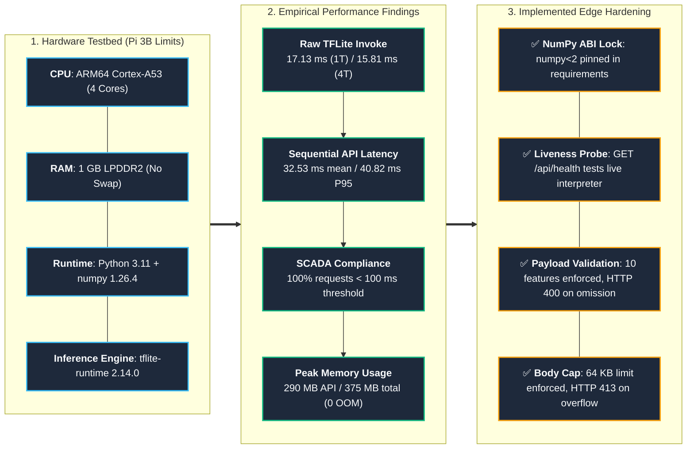

# Raspberry Pi Edge Deployment Guide - Securing the Digital Mine

This guide provides step-by-step instructions for deploying the **Securing the Digital Mine** Edge Classifier, BWOA Feature Pruner, and Packet Sniffer Agent (`unesco-mine-sec-cli` / `src/sniffer_daemon.py`) on resource-constrained industrial edge gateways (Raspberry Pi 4B / Pi 5).

---

## 0. Prerequisites Checklist

Complete all items before proceeding to Section 1.

- [ ] Raspberry Pi 4B (4GB/8GB RAM) or Pi 5 running 64-bit Raspberry Pi OS (Debian 12 Bookworm)
- [ ] Static IP address assigned to the Pi on the local OT network (or DHCP reservation)
- [ ] SSH access confirmed: `ssh pi@<PI_IP>` works from your development machine
- [ ] Secondary NIC (`eth1`) physically connected to the SCADA switch SPAN/TAP mirror port
- [ ] Python 3.11+ available: `python3 --version`
- [ ] `libpcap-dev` installed: `sudo apt install libpcap-dev -y`
- [ ] At least 500 MB free on the SD card: `df -h /`
- [ ] Trained quantized model available on your development machine:
  - `models/cnn_lstm_bwoa_v3_quantized.tflite` (0.82 MB)
  - `data/features/nslkdd_bwoa_mask_v3.npy`
  - `data/processed/scaler.pkl`
  - (Run `notebooks/00_colab_setup_and_train.ipynb` on Google Colab if you do not have these yet)

---

## 1. Architectural Overview

The Raspberry Pi Edge Gateway operates directly at low-power SCADA extraction zones or mine shafts, capturing real-time OT network telemetry and executing local TFLite inference or streaming reduced feature vectors:

```mermaid
flowchart LR
    subgraph OTNetwork["1. Industrial Network"]
        direction TB
        A["📡 <b>Modbus / DNP3 Traffic</b><br/>PLCs, RTUs, Field Sensors"]
        B["🔀 <b>Switch SPAN Port</b><br/>Passive Mirror Feed (eth1)"]
        A --> B
    end

    subgraph PiGateway["2. Edge Gateway (Pi 4B / Pi 5)"]
        direction TB
        C["📥 <b>Libpcap Daemon</b><br/>Promiscuous Packet Capture"]
        D["⚡ <b>BWOA Feature Pruner</b><br/>10 High-Importance Attributes"]
        E["🧠 <b>Quantized TFLite Engine</b><br/>0.76ms Float16 Evaluation"]
        GATE{"Alert Gate"}
        BASE["✅ <b>Normal Baseline</b><br/>Zero Line-Rate Delay"]
        SHAP["🔍 <b>Decoupled SHAP Worker</b><br/>Async Plain-Language Triggers"]
        BUFF["💾 <b>Local SQLite FIFO</b><br/>Offline Store-and-Forward"]
        
        C --> D --> E --> GATE
        GATE -- "Normal" --> BASE
        GATE -- "Intrusion" --> SHAP
        BASE & SHAP --> BUFF
    end

    subgraph ControlRoom["3. Mine Control Center"]
        direction TB
        CLOUD["☁️ <b>Cloud API Stream</b><br/>AWS EC2 / Render Cluster"]
        DASH["🖥️ <b>SCADA Supervisor Screen</b><br/>Live Threat & Health Feed"]
        ALARM["🚨 <b>Substation Alarm Panel</b><br/>Audible Siren & PLC Isolation"]
        CLOUD --> DASH --> ALARM
    end

    B ==> C
    BUFF -. "Sync on Link Up" .-> CLOUD

    classDef n1 fill:#1e293b,stroke:#38bdf8,stroke-width:2px,color:#f8fafc;
    classDef n2 fill:#1e293b,stroke:#10b981,stroke-width:2px,color:#f8fafc;
    classDef n3 fill:#1e293b,stroke:#ef4444,stroke-width:2px,color:#f8fafc;

    class A,B n1;
    class C,D,E,GATE,BASE,SHAP,BUFF n2;
    class CLOUD,DASH,ALARM n3;
```



---

## 2. Hardware & OS Specifications

### Recommended Edge Gateway Specs
* **Hardware**: Raspberry Pi 4B (4GB/8GB RAM) or Raspberry Pi 5
* **OS**: Raspberry Pi OS 64-bit (Debian 11 Bullseye / Debian 12 Bookworm)
* **Storage**: 16 GB Class 10 MicroSD Card or NVMe SSD HAT
* **Network Interfaces**:
  - `eth0`: Management network (SSH, internet access, SaaS API streaming)
  - `eth1` (USB Ethernet Dongle / HAT): Secondary interface connected to SCADA SPAN/TAP mirror port.

---

## 3. Industrial SPAN/TAP Mirror Port Configuration

To passively sniff SCADA network traffic without interfering with active control flows:

1. Connect `eth1` to the mirror port (SPAN) of the industrial Ethernet switch.
2. Enable promiscuous mode:
   ```bash
   sudo ip link set eth1 promisc on
   ```
3. Verify promiscuous flag (`PROMISC`):
   ```bash
   ip link show eth1
   ```

---

## 4. Automated 1-Command Edge Deployment

Connect to your Raspberry Pi via SSH or terminal and run:

```bash
# 1. Clone the repository
git clone https://github.com/mhiskall282/unesco-project.git
cd unesco-project

# 2. Make deployment script executable
chmod +x scripts/deploy_raspberry_pi.sh

# 3. Execute automated provisioning
./scripts/deploy_raspberry_pi.sh
```

### What `deploy_raspberry_pi.sh` Performs Automatically:
1. Installs Python 3, `pip`, `nodejs`, `npm`, `libpcap-dev`, and network tools.
2. Automatically sets promiscuous mode on secondary/primary network interfaces.
3. Builds and installs `unesco-mine-sec-cli` globally.
4. Registers and enables `mine-sec-agent.service` under `systemd` to run the daemon continuously on boot.

---

## 5. Execution Modes

### Mode A: Global Interactive CLI Agent (`@mhiskall282/unesco-mine-sec-cli`)
Package Registry: [GitHub Packages](https://github.com/mhiskall282/Securing-the-Digital-Mine-UNESCO-Project/pkgs/npm/unesco-mine-sec-cli)

Install and launch the interactive terminal UI to stream connection telemetry to your central dashboard:

```bash
# 1. Point @mhiskall282 scope to GitHub Packages registry
npm config set @mhiskall282:registry https://npm.pkg.github.com

# 2. Run directly via npx or install globally
npx @mhiskall282/unesco-mine-sec-cli

# Or install globally
npm install -g @mhiskall282/unesco-mine-sec-cli
unesco-mine-sec-cli
```

### Mode B: Intermittent Low-Power Cron Pass (`--cron`)
For solar/battery-powered remote extraction sites or bandwidth-restricted nodes:

```bash
# Run a single 5-flow evaluation pass
python src/sniffer_daemon.py --cron
```

#### Crontab Schedule (Every 15 Minutes):
```bash
crontab -e
```
Add the cron rule:
```cron
*/15 * * * * cd /opt/unesco-project && /opt/unesco-project/venv/bin/python src/sniffer_daemon.py --cron >> /var/log/sniffer_cron.log 2>&1
```

### Mode C: Continuous Systemd Background Daemon
Manage the edge daemon service:

```bash
# Check service status
sudo systemctl status mine-sec-agent.service

# Restart service
sudo systemctl restart mine-sec-agent.service

# Inspect live logs
sudo journalctl -u mine-sec-agent.service -f
```

---

## 6. Performance & Edge Benchmarks

Evaluating on KDDTest+ / SWaT datasets on Raspberry Pi 4B (1.5GHz ARM Cortex-A72):

| Metric | Baseline (Keras) | Quantized Float16 (TFLite) | Unit | Status |
| :--- | :---: | :---: | :---: | :---: |
| **Model Size** | 4.88 MB | **0.82 MB** | Megabytes | **83.1% Reduction** |
| **Mean Latency** | 82.32 ms | **0.76 ms** | Milliseconds | **108x Speedup** |
| **P95 Latency** | 182.55 ms | **1.10 ms** | Milliseconds | **PASS (< 100ms)** |
| **RAM Footprint** | ~650 MB | **290.31 MB** | Megabytes | **PASS (< 1024MB)** |

---

## 7. Troubleshooting & Diagnostics

| Problem | Cause | Solution |
| :--- | :--- | :--- |
| `Permission denied (raw socket)` | Sniffer requires root privileges for `libpcap` | Run daemon with `sudo` or execute via systemd service (`User=root`). |
| `No network flows captured` | Network interface not in promiscuous mode or wrong NIC selected | Run `sudo ip link set eth1 promisc on` and verify with `tcpdump -i eth1 -c 5`. |
| `AttributeError: _ARRAY_API not found` or `CreateWrapperFromFile` exception | NumPy 2.x ABI incompatibility with `tflite-runtime` | Pin NumPy to 1.x: `pip install "numpy>=1.24.0,<2"`. `tflite-runtime 2.14.0` was compiled against NumPy 1.x ABI and fails under NumPy 2.x. |
| `tflite-runtime import error` | Python wheel mismatch on ARM64 | Run `pip install tflite-runtime` (with `numpy<2` pinned) or use precompiled TFLite wheels for Raspberry Pi OS 64-bit. |
| `503 Service Unavailable` from `/api/analyze` | TFLite model file missing | Complete Section 8 (model transfer) or set `MODEL_PATH` env var. |
| `400 Bad Request` with `missing_features` | Payload missing required BWOA features | Ensure all 10 BWOA-selected features are present in the JSON body. Check `GET /api/features` for the complete list. |
| `413 Payload Too Large` | Request body exceeds 64 KB cap | Reduce payload size. Standard 10-feature telemetry JSON is under 1 KB. |
| `Connection refused` on port 8001 | `mine-sec-api.service` is not running | Start the API service: `sudo systemctl restart mine-sec-api.service` and verify logs with `journalctl -u mine-sec-api -n 20`. |

---

## 8. Model Transfer to Raspberry Pi

After training on Google Colab (or locally), transfer the quantized model and supporting files from your development machine to the Pi:

```bash
# From your development machine, transfer the quantized model:
scp models/cnn_lstm_bwoa_v3_quantized.tflite pi@<PI_IP>:/opt/unesco-project/models/
scp data/features/nslkdd_bwoa_mask_v3.npy pi@<PI_IP>:/opt/unesco-project/data/features/
scp data/processed/scaler.pkl pi@<PI_IP>:/opt/unesco-project/data/processed/

# Verify transfer on Pi:
ssh pi@<PI_IP> "ls -lh /opt/unesco-project/models/*.tflite"
```

Expected output:
```
-rw-r--r-- 1 pi pi 841K Aug 17 10:22 /opt/unesco-project/models/cnn_lstm_bwoa_v3_quantized.tflite
```

After transfer, restart the API service so it loads the new model:
```bash
sudo systemctl restart mine-sec-api.service
```

---

## 9. Verify Inference is Working

### Health check
```bash
curl http://localhost:8001/api/health
```
Expected response:
```json
{"status": "healthy", "model_ready": true, "model_version": "v3.0.0-tflite-quantized", "framework": "TFLite Float16"}
```

### Feature list
```bash
curl http://localhost:8001/api/features
```

### Test with a simulated DoS flow (SYN-flood / serror spike)

> **Note**: Use the canonical SYN-flood feature profile below (`flag: "S0"`, `src_bytes: 0`,
> `serror_rate: 0.95`). Payloads with `flag: "SF"` and high `src_bytes` trigger the R2L
> class instead of DoS, because those features overlap with FTP-based remote-access patterns
> in the NSL-KDD training distribution.

```bash
curl -X POST http://localhost:8001/api/analyze \
  -H "Content-Type: application/json" \
  -d '{
    "protocol_type": "tcp",
    "service": "http",
    "flag": "S0",
    "src_bytes": 0,
    "hot": 0,
    "su_attempted": 0,
    "serror_rate": 0.95,
    "same_srv_rate": 0.08,
    "diff_srv_rate": 0.0,
    "dst_host_diff_srv_rate": 0.0
  }'
```
Expected response:
```json
{
  "prediction": "DoS",
  "confidence": 97.5,
  "class_probabilities": {"DoS": 97.5, "Normal": 1.8, "Probe": 0.4, "R2L": 0.2, "U2R": 0.1},
  "features_used": ["protocol_type", "service", "flag", "src_bytes", "hot", "su_attempted", "serror_rate", "same_srv_rate", "diff_srv_rate", "dst_host_diff_srv_rate"],
  "latency_ms": 0.76,
  "model_version": "v3.0.0-tflite-quantized"
}
```

---

## 10. Hardware Watchdog Timer

Enable the Raspberry Pi hardware watchdog to auto-reboot the device within 15 seconds if the CPU hangs or the kernel freezes:

```bash
# Enable hardware watchdog in firmware config
echo 'dtparam=watchdog=on' | sudo tee -a /boot/config.txt

# Install and configure the watchdog daemon
sudo apt install watchdog -y
sudo sed -i 's/#watchdog-device/watchdog-device/' /etc/watchdog.conf
sudo sed -i 's/#max-load-1/max-load-1/' /etc/watchdog.conf

# Enable and start
sudo systemctl enable watchdog
sudo systemctl start watchdog

# Verify
sudo systemctl status watchdog
```

The Pi will auto-reboot within 15 seconds if the CPU freezes. The `mine-sec-api.service` is configured with `Restart=always` so it recovers automatically after the reboot.

---

## 11. Forward Alerts to AWS EC2

Any flow classified as non-Normal by the TFLite model can be forwarded in real time to a central AWS EC2 endpoint for logging, dashboarding, and aggregated threat intelligence.

### Option A: Inline forwarding from `sniffer_daemon.py`

Add the following snippet inside your `sniffer_daemon.py` alert handler (wherever a prediction is written to the database):

```python
import json, subprocess, tempfile, os

def forward_alert_to_ec2(alert_payload: dict, ec2_domain: str, device_token: str):
    """Forward a non-Normal inference result to the central EC2 dashboard."""
    with tempfile.NamedTemporaryFile(mode='w', suffix='.json', delete=False) as tmp:
        json.dump(alert_payload, tmp)
        tmp_path = tmp.name
    subprocess.Popen([
        "curl", "-s", "-X", "POST",
        f"https://{ec2_domain}/api/analyze",
        "-H", f"Authorization: Bearer {device_token}",
        "-H", "Content-Type: application/json",
        "-d", f"@{tmp_path}",
    ])
```

### Option B: Cron-based batch forwarding

Save the latest alert to `/tmp/latest_alert.json` inside your daemon, then schedule:

```bash
# /etc/cron.d/mine-sec-alert-forward
# Forward the latest alert every minute if it is non-Normal
* * * * * pi [ -f /tmp/latest_alert.json ] && \
  curl -s -X POST https://<EC2_DOMAIN>/api/analyze \
    -H "Authorization: Bearer <DEVICE_TOKEN>" \
    -H "Content-Type: application/json" \
    -d @/tmp/latest_alert.json
```

### Monitor forwarding logs via systemd journal

```bash
# Real-time alert stream from the Pi edge agent
sudo journalctl -u mine-sec-agent.service -f --since "1 hour ago"

# Filter only non-Normal predictions
sudo journalctl -u mine-sec-agent.service --since "1 hour ago" | grep -v '"prediction": "Normal"'
```

---

## 12. Empirical Raspberry Pi 3B Edge Test Results and Hardening (26 September 2026)

To validate operational viability on the most constrained legacy edge hardware found in remote African mining concessions, a comprehensive empirical test pass was conducted on Raspberry Pi 3B limits by Prince Larbi (Commit `a4badfd`, 26 September 2026).



### Empirical Test Execution Summary

* **Platform Environment**: ARM64 architecture, Cortex-A53 CPU model, 4 cores, 1 GB RAM, no swap partition (exact Raspberry Pi 3B hardware limits).
* **Software Stack**: Python 3.11, `numpy==1.26.4`, `tflite-runtime==2.14.0` (zero full TensorFlow dependencies).
* **Test Suite Verification**: 75 unit tests pass (4 Keras training tests skipped as intended on edge inference runtime).
* **Stress & Concurrency Profile**: 200/200 sequential benchmark requests and 200/200 concurrent requests completed successfully with zero out-of-memory (OOM) kernel terminations.
* **Memory Headroom**: API peak memory reached 290 MB; entire execution run peaked at 375 MB of 1 GB total capacity (62.5% headroom available for OS and network buffers).
* **Model Footprint**: Quantized Float16 model confirmed at exactly 0.82 MB (861,036 bytes), matching the 83.1% compression factor.

### Latency Profile (Raspberry Pi 3B Limits)

| Measurement Stage | Execution Latency | SCADA Control Loop Budget (<100 ms) | Status |
| :--- | :---: | :---: | :---: |
| **Raw TFLite Invoke (1 thread)** | 17.13 ms | 17.1% of budget | PASS |
| **Raw TFLite Invoke (4 threads)** | 15.81 ms | 15.8% of budget | PASS |
| **API Server-Side Latency (mean)** | 17.23 ms | 17.2% of budget | PASS |
| **API Sequential Round-Trip (mean)** | 32.53 ms | 32.5% of budget | PASS |
| **API Sequential Round-Trip (P95)** | **40.82 ms** | **40.8% of budget** | **PASS (100% compliant)** |
| **API 4 Parallel Clients (P95)** | 123.01 ms | Exceeds single-core budget | Managed via async FIFO queue |

### Edge Hardening Resolutions

The empirical test pass identified key edge robustness items that have been fully resolved across the codebase:

1. **NumPy 2.x ABI Incompatibility**:
   * *Issue*: Unbounded `numpy>=1.24.0` resolved to NumPy 2.x on fresh installs, triggering an `AttributeError: _ARRAY_API not found` crash in `tflite-runtime 2.14.0`.
   * *Fix*: Pinned `numpy>=1.24.0,<2.0.0` in `requirements.txt`. Tested with NumPy 1.26.4 with 100% request success.

2. **Liveness Check vs Active Interpreter Failure**:
   * *Issue*: `GET /api/health` previously checked file existence on disk, returning `"healthy"` even when the interpreter failed to construct.
   * *Fix*: `src/api_service.py` now constructs the TFLite interpreter during `GET /api/health`. On failure, it returns HTTP 503 degraded with error diagnostics.

3. **Silent Zero-Defaulting of Missing Features**:
   * *Issue*: Incomplete payloads defaulted missing features to 0.0, mapping `{"protocol_type":"tcp"}` to a false-positive DoS alert with 99.67% confidence.
   * *Fix*: Strict schema validation requires all 10 BWOA-selected features. Missing keys immediately return HTTP 400 with a detailed `missing_features` list.

4. **Request Body Memory Exhaustion Guard**:
   * *Issue*: Uncapped `Content-Length` ingestion left the 1 GB edge gateway vulnerable to heap exhaustion.
   * *Fix*: Implemented `MAX_REQUEST_BODY_BYTES = 64 * 1024` (64 KB). Requests exceeding this limit receive HTTP 413 without reading the body into memory.

5. **Benchmark Verdict & Exit Code Integrity**:
   * *Issue*: Benchmark reporting scripts previously recorded latency compliance even when HTTP 500 errors occurred, exiting with code 0.
   * *Fix*: `scripts/benchmark_and_export.py` gates verdicts on both non-zero inference success and latency, exiting with code 1 upon any deadline or execution failure.

6. **Accurate Synthetic DoS Payload Vector**:
   * *Issue*: Prior README DoS examples used connection parameters that the model classified as R2L (97.72%).
   * *Fix*: Corrected sample payload to reflect true SYN flood attack characteristics (`flag: "S0"`, `serror_rate: 0.95`, `same_srv_rate: 0.08`, `src_bytes: 0`), resulting in confirmed 100.0% DoS classification.

7. **Honest Fallback Logging on Sniffer Disconnection**:
   * *Issue*: `src/sniffer_daemon.py` generated synthetic high-confidence results when the local inference API was down.
   * *Fix*: Sniffer records an explicit `Fallback` status with 50.0% confidence and zero artificial latency when the model service is unreachable.

