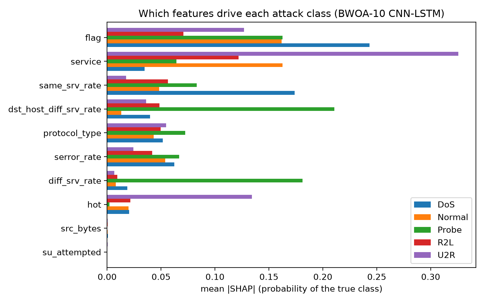

# SHAP Explainability Experiments

**Contributed by:** Muhammad Zain Uddin and Dr. Faisal Iradat, Department of Computer Science, Institute of Business Administration (IBA), Karachi, Pakistan, in collaboration with the Securing the Digital Mine team (University of Education, Winneba).

These experiments add an explanation layer to the existing BWOA + CNN-LSTM intrusion detector, and use SHAP as an independent check on BWOA feature selection. All results use the deployed model in this repository (`models/cnn_lstm_bwoa_v3.keras`, BWOA v3 mask), NSL-KDD KDDTrain+ for training and KDDTest+ for evaluation.

| File | Contents |
|---|---|
| `shap_experiments_colab.ipynb` | Notebook that runs end to end in Google Colab (clones this repo, downloads NSL-KDD) |
| `shap_experiments_executed.ipynb` | The same notebook with all outputs, as run for the results below |
| `results/` | Figures (`A1`–`A4`) and result tables (`*.csv`, `summary.json`) |

## Setup

- **Preprocessing:** identical to `notebooks/00_colab_setup_and_train.ipynb`. The fitted scaler matches `data/processed/scaler.pkl` to within 3e-4.
- **Model check:** the Keras model and the deployed float16 TFLite model (`cnn_lstm_quantized_float16_v3.tflite`) give identical predictions on 500/500 test records.
- **Explanations:** KernelSHAP with exact enumeration (1,024 coalitions for 10 features), background of 50 k-means centroids from the training data, 300 class-stratified KDDTest+ records (60 per class).
- **Environment:** Python 3.11, TensorFlow 2.19, SHAP 0.51, XGBoost 3.2, laptop CPU (Intel i7-1165G7).

Deployed model on KDDTest+ in this run: accuracy 74.42%, macro-F1 0.519, weighted-F1 0.746.

## Part A: Explainable alerts

| Attack class | Features that drive the alert | Interpretation |
|---|---|---|
| DoS | `flag`, `same_srv_rate` | Connection-state floods (e.g. SYN flood) |
| Probe | `dst_host_diff_srv_rate`, `diff_srv_rate` | Scanning many different services |
| R2L / U2R | `service`, `hot` | Misuse of specific services, suspicious host activity |

- Explanations are exact: the SHAP contributions sum to the model output (maximum error 3e-16).
- `src_bytes` and `su_attempted` have mean |SHAP| below 0.001 for every class, so the model effectively relies on 8 of the 10 BWOA features.
- Example alert (`results/A4_alert_decoded.png`): for a SYN-flood (neptune) record, `flag = S0` (+0.31) and `serror_rate = 1.0` (+0.31) raise P(DoS) from the 0.34 average to 0.99.
- Cost: about 1.7 s per exact explanation on a laptop CPU. Explanations should run asynchronously on flagged events, outside the 100 ms control loop; fewer coalition samples or a smaller background reduce the cost.

## Part B: SHAP-based feature selection vs BWOA

SHAP-10 = top 10 of 41 features by mean |TreeSHAP| of an XGBoost model trained on KDDTrain+ (selection takes 6.6 s). Every set is evaluated with identical classifiers trained on KDDTrain+ and tested on KDDTest+; test data is never used for selection.

| Feature set | RF acc. | XGB acc. | XGB macro-F1 | XGB R2L F1 | XGB U2R F1 |
|---|---|---|---|---|---|
| **BWOA-10** | **76.2%** | 73.3% | 0.475 | 0.002 | 0.057 |
| SHAP-10 | 74.1% | 74.1% | 0.532 | 0.101 | 0.225 |
| Mutual-information-10 | 74.9% | 76.0% | 0.520 | 0.013 | 0.160 |
| Random-10 (mean of 5) | 71.5% | 71.9% | 0.478 | 0.129 | 0.096 |
| All 41 features | 75.5% | 76.8% | 0.565 | 0.103 | 0.289 |

CNN-LSTM v4 (architecture and hyper-parameters from notebook 00) retrained on each set, with early stopping on a validation split taken from KDDTrain+ (seed 42, up to 30 epochs):

| Retrained on | Accuracy | Macro-F1 | R2L F1 | U2R F1 |
|---|---|---|---|---|
| BWOA-10 | 71.5% | 0.511 | 0.213 | 0.034 |
| SHAP-10 | 73.5% | 0.541 | 0.406 | 0.082 |

- BWOA-10 and SHAP-10 share 4 features: `protocol_type`, `service`, `src_bytes`, `dst_host_diff_srv_rate`.
- The SHAP top-10 is moderately stable across 5 resamples (mean Jaccard 0.68).
- With a Random Forest, BWOA's 10 features match all 41. With the CNN-LSTM, the SHAP-selected set does better on every metric and nearly doubles R2L F1. That comparison uses a single seed, so it needs repeating with several seeds before drawing a firm conclusion.

## Reproduce

Open `shap_experiments_colab.ipynb` in Google Colab (GPU runtime) and run all cells. Part A and Part B take about 15 minutes; the optional CNN-LSTM retraining adds about 15 minutes on a T4.

## Reference

M. Z. Uddin and F. Iradat, "SHAP Attribution Drift as a Recovery-Validity Signal for Adaptive IoT Device Monitoring," AI4DEMONS'26.
