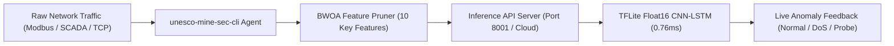

# @mhiskall282/unesco-mine-sec-cli

> **Real-Time Edge Network Flow Scanner and Telemetry Agent**  
> *Part of the "Securing the Digital Mine" Intrusion Detection Suite (UNESCO Young Scientists Forum 2026)*

[](LICENSE)
[](https://nodejs.org)
[](https://github.com/mhiskall282/Securing-the-Digital-Mine-UNESCO-Project/pkgs/npm/unesco-mine-sec-cli)
[](mailto:hello@johnokyere.xyz)

---

## 📖 What is `unesco-mine-sec-cli`?

`@mhiskall282/unesco-mine-sec-cli` is a cross-platform command-line telemetry agent purpose-built for industrial mining facilities, SCADA control systems, and edge IoT devices (such as Raspberry Pi 4/5 and industrial gateways).

Historically, deploying intrusion detection on remote mining sites has been difficult due to constrained compute and intermittent connectivity. This CLI solves that by running a lightweight network flow sensor that hooks local network adapters, extracts the **10 features optimized by the Binary Whale Optimization Algorithm (BWOA)**, and streams telemetry in real-time to your central inference API or SaaS dashboard for instant CNN-LSTM threat classification.

---

## ⚡ How It Works



1. **Adapter Sniffing**: The agent hooks into the chosen network interface (Ethernet, Wi-Fi, or industrial bridge).
2. **Feature Extraction**: It extracts only the 10 high-value features selected by the BWOA algorithm, reducing payload size by 75.61%.
3. **Real-Time Streaming**: Flows are securely forwarded over HTTP/HTTPS with Bearer token authentication to your API endpoint.
4. **Instant Classification**: Receives sub-millisecond intrusion predictions (`Normal`, `DoS`, `Probe`, `R2L`, `U2R`) with confidence scores and logs them live in the terminal.

---

## 🚀 Quick Start & Installation Guide

> ⚠️ **Important Registry Note**: This package is hosted on **GitHub Packages Registry** (`npm.pkg.github.com`), not the default npmjs.org registry. If you run `npm install` without configuring the registry, npm will return a `404 Not Found` error. Follow either of the methods below:

### Method 1: Install from GitHub Packages (Recommended)

Tell npm to resolve the `@mhiskall282` scope from GitHub Packages:

```bash
# 1. Map the @mhiskall282 scope to GitHub Packages registry
npm config set @mhiskall282:registry https://npm.pkg.github.com

# 2. Install globally
npm install -g @mhiskall282/unesco-mine-sec-cli

# 3. Launch the interactive CLI
unesco-mine-sec-cli
```

### Method 2: Zero-Config Install from Cloned Repository

If you prefer not to configure npm registries:

```bash
git clone https://github.com/mhiskall282/Securing-the-Digital-Mine-UNESCO-Project.git
cd Securing-the-Digital-Mine-UNESCO-Project/npm-packet-scanner
npm install -g .
unesco-mine-sec-cli
```

---

## ❓ Troubleshooting `404 Not Found`

If you encounter:
```text
npm error 404 Not Found - GET https://registry.npmjs.org/@mhiskall282%2funesco-mine-sec-cli - Not found
```

**Cause**: Your npm client is trying to fetch the package from the default public registry (`registry.npmjs.org`) instead of GitHub Packages.

**Solution**: Run the following command once in your terminal:
```bash
npm config set @mhiskall282:registry https://npm.pkg.github.com
```
Then rerun `npm install -g @mhiskall282/unesco-mine-sec-cli`.

### Option 3: Local Source Build

```bash
git clone https://github.com/mhiskall282/Securing-the-Digital-Mine-UNESCO-Project.git
cd Securing-the-Digital-Mine-UNESCO-Project/npm-packet-scanner
npm install
npm link
unesco-mine-sec-cli
```

---

## 🖥️ Usage Guide

### 1. Interactive Mode
If you run `unesco-mine-sec-cli` without arguments, it will launch an interactive setup wizard prompting you for:
* **Dashboard REST API URL**: Your cloud or local inference endpoint (e.g., `http://localhost:8001/api/analyze`).
* **Network Interface**: Select from detected network adapters on your machine.
* **API / Organization Token**: Device Bearer token for authenticating against your multi-tenant dashboard.

```text
=============================================
    Securing the Digital Mine - CLI Client   
   OT/IoT Intrusion Detection Flow Scanner   
=============================================

? Enter Dashboard REST API URL: https://minesec-dashboard-prod.onrender.com/api/external/analyze
? Select Network Interface to sniff: eth0
? Enter API Token / Organization Token: [hidden]

[*] Hooking adapter eth0...
[*] Target API Endpoint: https://minesec-dashboard-prod.onrender.com/api/external/analyze
[*] Press Ctrl+C to stop scanning.

[+] Connection verified. Classifier is ONLINE.

[03:30:12] Flow captured on eth0 -> Inference: Normal (Conf: 98.4%)
[03:30:14] Flow captured on eth0 -> Inference: Normal (Conf: 99.1%)
[03:30:16] Flow captured on eth0 -> Inference: DoS (Conf: 96.0%)
```

### 2. Headless / Automated Daemon Mode
For background services, cron tasks, or Raspberry Pi systemd units, pass CLI flags to bypass prompts:

```bash
# Automated execution with custom endpoint and API key
unesco-mine-sec-cli \
  --url "https://minesec-dashboard-prod.onrender.com/api/external/analyze" \
  --key "unesco_device_token_2026" \
  --interface "eth0"
```

---

## ⚙️ Command-Line Options

| Flag | Shorthand | Description | Default |
| :--- | :--- | :--- | :--- |
| `--help` | `-h` | Display help menu and CLI options | `false` |
| `--version` | `-v` | Display CLI software version | `false` |
| `--url <endpoint>` | | Target API Gateway / inference endpoint URL | `https://minesec-dashboard-prod.onrender.com/api/external/analyze` |
| `--key <token>` | | Device Node Bearer Token for organization scoping | `unesco_demo_token_2026` |
| `--interface <adapter>` | | Network adapter name to sniff (e.g., `eth0`, `wlan0`) | *First active adapter* |

---

## 🔍 Monitored BWOA Features

The scanner specifically isolates and tracks the 10 BWOA-selected features that provide maximum intrusion discrimination with minimal telemetry overhead:

| Feature Name | Category | Purpose |
| :--- | :--- | :--- |
| `protocol_type` | Connection | Protocol identification (TCP, UDP, ICMP) |
| `service` | Connection | Target network service (HTTP, Modbus, DNP3, Private) |
| `flag` | State | Connection completion status (SF, S0, REJ, etc.) |
| `src_bytes` | Volume | Bytes transmitted from source (vital for volumetric DoS) |
| `hot` | Access | Indicators of access to sensitive system directories |
| `su_attempted` | Privilege | Root/super-user access attempts (U2R signal) |
| `serror_rate` | Error Rate | Percentage of connections with SYN errors |
| `same_srv_rate` | Traffic | Proportion of connections targeting the same service |
| `diff_srv_rate` | Traffic | Proportion of connections targeting different services |
| `dst_host_diff_srv_rate` | Host Traffic | Destination host service dispersion (Probe indicator) |

---

## 🤝 Support & Reaching Out

If you need assistance deploying the CLI, configuring edge sensors, or integrating custom industrial SCADA protocols:

* **Technical Lead & Research Lead**: **John Okyere**
* **Support Email**: [hello@johnokyere.xyz](mailto:hello@johnokyere.xyz)
* **Website**: [johnokyere.xyz](https://johnokyere.xyz)
* **GitHub Issues**: [Open an Issue](https://github.com/mhiskall282/Securing-the-Digital-Mine-UNESCO-Project/issues)
* **Project Delegation**: University of Education, Winneba & UEW Innovation Hub

---

## 📄 License

This software is released under the **MIT License**. See the [LICENSE](https://github.com/mhiskall282/Securing-the-Digital-Mine-UNESCO-Project/blob/main/LICENSE) file in the main repository for full terms.
