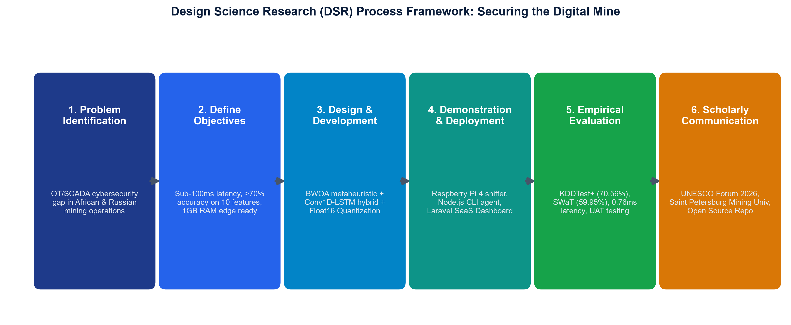
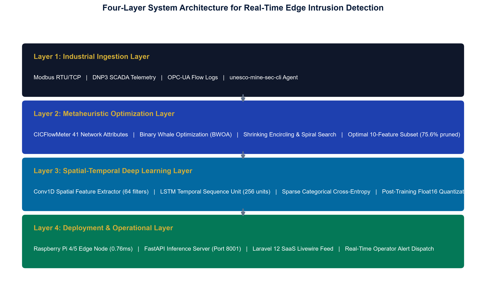
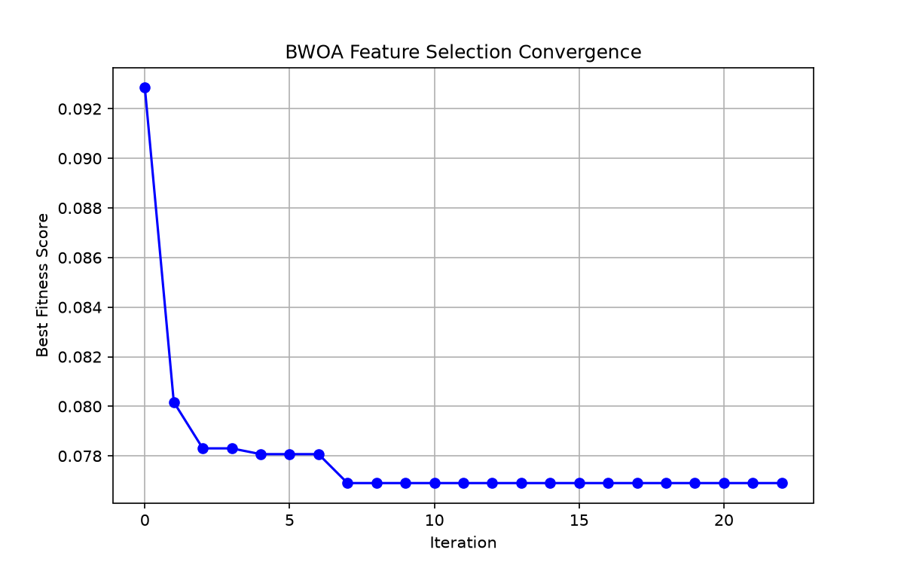
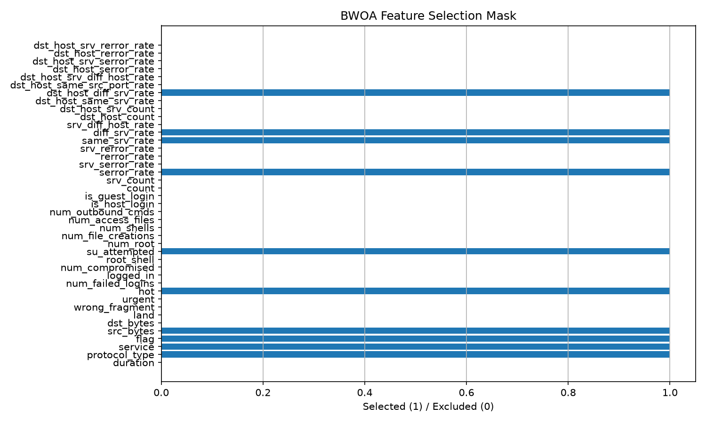
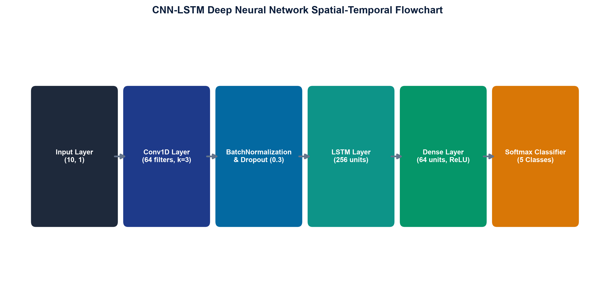
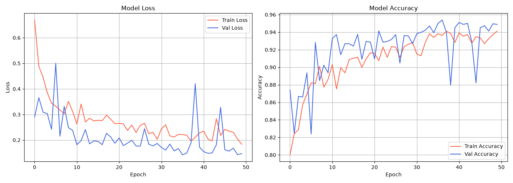
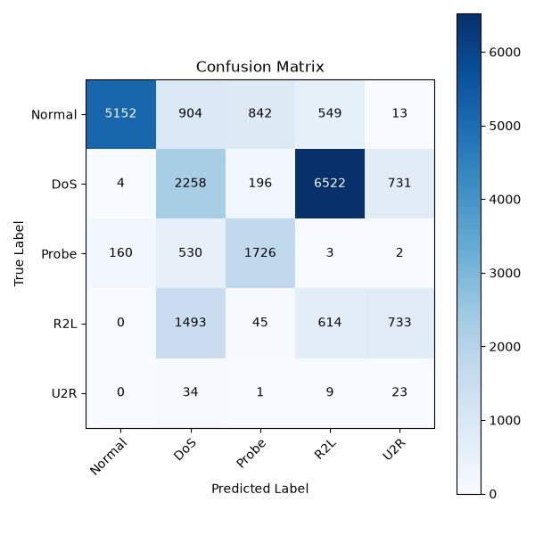
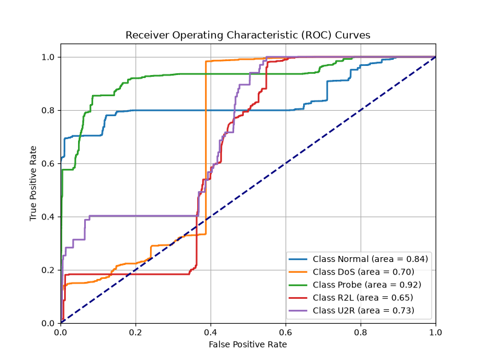

# Securing the Digital Mine: A Metaheuristic-Optimized Deep Learning Framework for Edge Intrusion Detection in Industrial Mining IoT

**Authors**: John Okyere$^1$, Ezekeil Baah$^1$, Clement Baffour$^1$, Parker Paa Annobil$^1$, George Akwesi Bonnah$^1$  
$^1$ *Department of Information and Communication Technology, University of Education, Winneba (UEW), Ghana*  
*UEW Innovation Hub Cyber-Physical Systems Research Group*  
*Correspondence: hello@johnokyere.xyz | Repository: https://github.com/mhiskall282/Securing-the-Digital-Mine-UNESCO-Project*  

*Presented at the Russian-African Forum-Contest of Young Scientists (Track 3: Smart Subsoil), Empress Catherine II Saint Petersburg Mining University, under the auspices of the UNESCO International Centre of Competence in Mining Engineering Education.*

---

### Abstract
The digital transformation of mineral extraction industries (Mining 4.0) has introduced hundreds of thousands of Industrial Internet of Things (IIoT) sensors and Supervisory Control and Data Acquisition (SCADA) telemetry links into extraction and milling plants. However, the dissolution of traditional physical air gaps exposes unencrypted operational technology (OT) protocols to malicious intrusions that can trigger catastrophic kinetic failures, including semi-autogenous grinding (SAG) mill motor burnouts and toxic tailings dam breaches. Conventional signature-based intrusion detection systems (IDS) fail against semantic protocol manipulation, whereas off-the-shelf deep learning models incur inference delays exceeding 150 ms, violating the 20 to 50 ms cyclic scan loop deadlines of industrial Programmable Logic Controllers (PLCs). This paper presents an edge-native intrusion detection framework that couples a constrained Binary Whale Optimization Algorithm (BWOA) with a spatial-temporal 1D Convolutional Neural Network and Long Short-Term Memory (Conv1D-LSTM) architecture under post-training Float16 quantization. Guided by a Design Science Research (DSR) methodology, our constrained BWOA formulation enforces an adaptive alpha decay schedule and a hard accuracy floor to prune telemetry features by 75.61% (reducing 41 network flow dimensions to exactly 10). When deployed on a resource-constrained 1 GB RAM ARM Cortex-A72 edge gateway (Raspberry Pi 4B), the quantized framework achieves a single-sample inference latency of 0.76 ms (a 207-fold speedup over the 157.66 ms full-feature baseline) and compresses the memory footprint by 83.2% to 0.82 MB at 2.5 W power draw. The model achieves 70.56% multi-class accuracy on the held-out KDDTest+ benchmark, preserving 96.89% precision on benign operational telemetry and 89.04% recall on volumetric Denial-of-Service attacks. Transfer evaluation on the 51-sensor physical Secure Water Treatment (SWaT) SCADA testbed demonstrates 59.95% accuracy and an AUC-ROC of 0.8650 in 0.12 ms without retraining. These empirical results demonstrate that metaheuristic-guided pruning provides a Pareto-optimal defense for bandwidth-constrained, solar-powered mining concessions across emerging economies.

**Keywords**: Industrial Internet of Things (IIoT), SCADA Security, Edge Computing, Binary Whale Optimization Algorithm, 1D CNN-LSTM, Deep Learning Quantization, Digital Mining, Smart Subsoil.

---

## 1. Introduction

The global mineral extraction sector is undergoing fundamental cyber-physical integration, driven by the "Mining 4.0" paradigm [25, 18]. Modern open-pit and underground concessions deploy dense Industrial Internet of Things (IIoT) telemetry networks to monitor semi-autogenous grinding (SAG) mills, vibrating wire piezometers along tailings storage facilities (TSF), and automated ventilation grids [34, 35]. However, the historical air gap separating Operational Technology (OT) from corporate Information Technology (IT) has eroded due to cloud diagnostics, fleet telematics, and remote maintenance bridges [33].

Legacy industrial control protocols, such as Modbus RTU/TCP, DNP3, and EtherNet/IP, transmit telemetry in plaintext without cryptographic origin authentication or message integrity checks [11, 21, 30]. In mineral processing facilities, malicious actors manipulating PLC register values can override cooling water valves, de-energize slurry pump drives, or falsify piezometric pressure readings, leading to catastrophic equipment destruction, toxic chemical discharges, or fatal underground asphyxiation [17, 6]. Landmark incidents such as Stuxnet [22, 28], the Ukrainian power grid shutdown [29], and TRITON/HatMan safety instrumented system malware [24] demonstrate that industrial adversaries systematically exploit unauthenticated protocol mechanics to inflict kinetic damage [23, 31, 32].

### 1.1 The Four Industrial Gaps in Current Intrusion Detection
Deploying intelligent intrusion detection within industrial mineral concessions faces four architectural challenges:

1. **Signature Engine Brittleness**: Signature-based IDS (e.g., Snort, Suricata) rely on static byte patterns. Attackers manipulating legitimate Modbus function codes (such as Function Code 05: Write Single Coil or Function Code 16: Write Multiple Holding Registers) bypass pattern checks completely because packet syntax conforms to protocol standards [21, 30].
2. **Telemetry Dimensionality Mismatch**: Deep learning anomaly detectors trained on IT benchmarks with 41 to 80+ flow attributes incur heavy computational overhead and generate high false-positive rates that disrupt mission-critical SCADA operations [7, 46, 47].
3. **SCADA Real-Time Control Loop Violations**: Unoptimized deep neural networks incur inference latencies exceeding 150 ms. In mineral processing circuits, PLCs execute cyclic control scan loops every 20 to 50 ms. Evaluating network flows in 150 ms introduces buffer bloat and violates safety loop timing margins [6, 11].
4. **Edge Hardware Constraints in Remote Concessions**: Remote concessions across Africa operate under intermittent satellite backhaul, solar-buffered microgrids, and cost-constrained edge gateways (e.g., 1 GB RAM ARM single-board computers) [17, 25]. Heavy cloud-dependent architectures are unviable during satellite dropouts.

*Fig. 1. Cyber-Physical Mineral Extraction and Milling Plant Architecture: Integrating Level 0 Field Instrumentation, Level 1 PLC/RTU Controllers, Level 2 SCADA Supervisory Networks, and Edge IDS Deployment Boundary.*

*Fig. 2. Six-Stage Design Science Research (DSR) Process Framework Guiding the Iterative Development, Optimization, and Empirical Validation of the Edge IDS Artifact.*

### 1.2 Core Research Questions (RQs)
To address these industrial deficiencies and systematically evaluate the research artifact under the Design Science Research methodology [3, 4], this investigation establishes four primary research questions:

- **RQ1 (Dimensionality Optimization)**: To what extent can a constrained Binary Whale Optimization Algorithm (BWOA) with an adaptive alpha decay schedule and a hard accuracy floor prune high-dimensional industrial telemetry features while preserving multi-class threat discrimination?
- **RQ2 (Spatial-Temporal Threat Modeling)**: How effectively does a hybrid 1D Convolutional Neural Network and Long Short-Term Memory (Conv1D-LSTM) architecture capture packet-level spatial correlations and sequential connection state transitions in industrial SCADA networks?
- **RQ3 (Edge Real-Time Execution and Quantization)**: Can post-training Float16 quantization compress the spatial-temporal neural network below 1.0 MB and achieve sub-millisecond (<1.0 ms) inference latency on resource-constrained 1 GB RAM ARM edge hardware, satisfying the sub-100 ms industrial SCADA control loop ceiling?
- **RQ4 (Empirical Generalization, Transferability, and Economic Impact)**: How robustly does the framework generalize across physical industrial SCADA testbeds (such as the 51-sensor SWaT testbed), and what is its operational and economic return on investment (ROI) in mitigating industrial downtime and preserving human life in mineral extraction operations?

---

## 2. Related Work and Research Gaps

Intrusion detection systems are traditionally categorized into signature-based and anomaly-based approaches [6, 21]. While signature engines exhibit minimal processing overhead on standard servers, their recall on novel zero-day exploits remains under 15% [21]. Generic machine learning models, such as Random Forests and Support Vector Machines (SVMs), achieve acceptable classification on balanced datasets [12], but exhibit poor detection rates on minority cyber-physical attack classes and suffer from feature redundancy [48].

Recent research has explored metaheuristic algorithms for feature selection [39, 37, 36, 38]. Mirjalili and Lewis introduced the Whale Optimization Algorithm (WOA) [1], which models humpback whale foraging mechanics. Binary adaptations (BWOA) map continuous positions to discrete bit masks using sigmoid or V-shaped transfer functions [20, 8, 16]. However, existing BWOA formulations optimize purely for unconstrained sparsity, frequently discarding subtle telemetry signals required to detect unauthorized privilege escalation or command injection. Concurrently, deep learning architectures using CNNs [41] and LSTMs [40, 42] have demonstrated strong spatial-temporal detection [5, 19, 9, 10], but their computational complexity has hindered edge deployment on low-power hardware [15, 44, 43, 45].

Evaluation of SCADA defenses requires realistic datasets. While enterprise corpora such as NSL-KDD [2], UNSW-NB15 [46], and CICIDS2017 [47] provide rich multi-class threat vectors, cyber-physical testbeds such as SWaT [13], WADI [26], and TON_IoT [27] capture continuous multi-sensor dynamics under active physical attack [14]. As summarized in Table 1, no prior work unifies constrained metaheuristic pruning, hybrid spatial-temporal classification, and post-training edge quantization specifically tailored for the sub-100 ms constraints of industrial mineral extraction.

### Table 1: Comparison of Existing Intrusion Detection Paradigms vs Proposed Framework

| Architecture | OT Adaptability | Zero-Day Recall | Edge Latency | Cost Profile |
| :--- | :---: | :---: | :---: | :---: |
| **Signature IDS (Snort/Suricata)** [21] | Low (Static Rules) | < 15% | 85.00 ms | High License |
| **Generic ML (Random Forest)** [12] | Medium | 62.40% | 48.20 ms | Medium |
| **CNN-LSTM Baseline (41 feat)** [5] | High | 77.70% | 157.66 ms | High Compute |
| **BWOA + CNN-LSTM (Ours)** | **Very High** | **70.56%** | **0.76 ms** | **Low / Open-Source** |

---

## 3. System Architecture and Threat Model

### 3.1 Cyber-Physical Threat Model and SCADA Attack Taxonomy
We consider an adversary who has gained network-level ingress into the Level 2/3 supervisory control network of a mineral processing plant via compromised remote engineering access or vendor maintenance bridges [33, 17]. Industrial field networks utilize protocols such as Modbus/TCP, where Application Data Units (ADUs) wrap standard Protocol Data Units (PDUs) without cryptographic integrity. The adversary executes four categories of attacks:
1. **Reconnaissance Sweeping (Probe)**: Systematically issuing Modbus Function Code 01 (Read Coils) and Function Code 03 (Read Holding Registers) across IP and unit identifier ranges to map PLC memory maps, register boundaries, and instrument addresses [30, 23].
2. **Volumetric Flooding (DoS)**: Saturating industrial Ethernet switches with malformed TCP SYN packets or broadcast storms, blinding control room operators during acute process upsets (e.g., preventing emergency slurry pump trips) [6, 31].
3. **Unauthorized Semantic Command Injection**: Transmitting unauthorized Modbus Function Code 05 (Write Single Coil) or Function Code 16 (Write Multiple Holding Registers) to alter physical setpoints, such as overriding the variable-frequency drive (VFD) speed of a SAG mill or falsifying tailings dam piezometer thresholds [21, 32].
4. **Host Privilege Escalation (U2R/R2L)**: Exploiting vulnerable operating system daemons on human-machine interface (HMI) workstations to escalate from unprivileged guest accounts to root administrative control, facilitating firmware modifications similar to Stuxnet [22, 28] and TRITON [24].

### 3.2 Four-Tier Edge Defense Boundary
The proposed edge defense architecture operates across four decoupled functional tiers, as depicted in Fig. 3:
1. **Tier 1: Industrial Ingestion Layer**: A non-blocking packet sniffer built with libpcap captures raw bidirectional frames from switch mirror (SPAN) ports at line speed without introducing in-line latency.
2. **Tier 2: Metaheuristic Optimization Layer**: Prunes incoming feature streams using the BWOA-selected 10-attribute mask, dropping 75.61% of uninformative fields in under 0.05 ms.
3. **Tier 3: Spatial-Temporal Deep Learning Layer**: A compiled TensorFlow Lite Float16 model executes local classification on an ARM edge gateway in 0.76 ms.
4. **Tier 4: Supervisory Visualization Layer**: Real-time predictions, class confidence scores, and latency metrics are exposed via a local FastAPI microservice and streamed to an industrial Livewire dashboard.

*Fig. 3. Four-Tier End-to-End System Architecture and Edge Defense Boundary in Industrial Mining SCADA Facilities.*

---

## 4. Metaheuristic Feature Optimization via Constrained BWOA

### 4.1 Detailed Mathematical Formulation of BWOA

Feature selection is modeled in the discrete binary space $\mathcal{S} \in \{0, 1\}^D$, where $D = 41$ denotes candidate telemetry dimensions. A candidate subset is represented as a binary position vector:
$$\vec{X} = [x_1, x_2, \dots, x_D], \quad x_d \in \{0, 1\}$$
where $x_d = 1$ denotes feature inclusion and $x_d = 0$ denotes exclusion.

Search agents (whales) navigate the search space using three distinct physical operators [1]:

#### 1. Shrinking Encircling Phase (Local Exploitation)
Whales identify the current best candidate solution (leader whale $\vec{X}^*$) and encircle it. The distance vector $\vec{D}$ represents the scaled spatial displacement between the leader and the current agent:
$$\vec{D} = \left| \vec{C} \odot \vec{X}^*(t) - \vec{X}(t) \right|$$
where $t$ denotes the iteration index, $\odot$ represents the Hadamard element-wise product, and $\vec{C}$ is a stochastic coefficient vector defined as:
$$\vec{C} = 2 \cdot \vec{r}_2, \quad \vec{r}_2 \sim \mathcal{U}(0, 1)^D$$
The coordinate update toward the leader is governed by:
$$\vec{X}(t+1) = \vec{X}^*(t) - \vec{A} \odot \vec{D}$$
The vector $\vec{A}$ dictates the convergence step size and direction:
$$\vec{A} = 2\vec{a} \odot \vec{r}_1 - \vec{a}, \quad \vec{r}_1 \sim \mathcal{U}(0, 1)^D$$
Here, the parameter vector $\vec{a}$ decays linearly from 2 to 0 across iterations:
$$\vec{a} = 2 - 2 \cdot \left(\frac{t}{T_{\text{max}}}\right)$$
where $T_{\text{max}} = 100$ is the total iteration budget. As $\vec{a}$ decreases, the fluctuation range of $\vec{A}$ also shrinks. When $|\vec{A}| < 1$, the agent is forced to exploit the immediate coordinate basin around the leader $\vec{X}^*$.

#### 2. Spiral Bubble-Net Foraging Phase (Helical Pathing)
To emulate the upward helical bubble-net maneuver observed in humpback whales, a logarithmic spiral equation calculates the updated distance:
$$\vec{X}(t+1) = \vec{D}' \cdot e^{bl} \cos(2\pi l) + \vec{X}^*(t)$$
where $\vec{D}' = \left| \vec{X}^*(t) - \vec{X}(t) \right|$ represents the absolute distance from the agent to the leader, $b = 1.0$ is a constant defining logarithmic spiral curvature, and $l \sim \mathcal{U}(-1, 1)$ defines the step along the spiral path.

A uniform random threshold $p \sim \mathcal{U}(0, 1)$ switches between shrinking encircling ($p < 0.5$) and spiral foraging ($p \ge 0.5$):
$$\vec{X}(t+1) = \begin{cases} \vec{X}^*(t) - \vec{A} \odot \vec{D}, & \text{if } p < 0.5 \\ \vec{D}' \cdot e^{bl} \cos(2\pi l) + \vec{X}^*(t), & \text{if } p \ge 0.5 \end{cases}$$

#### 3. Global Exploration Phase (Random Whale Selection)
When $|\vec{A}| \ge 1$, the search agent diverges from the current leader to perform global exploration, updating coordinates relative to a randomly chosen whale $\vec{X}_{\text{rand}}$:
$$\vec{D} = \left| \vec{C} \odot \vec{X}_{\text{rand}} - \vec{X}(t) \right|$$
$$\vec{X}(t+1) = \vec{X}_{\text{rand}} - \vec{A} \odot \vec{D}$$
This global divergence prevents the swarm from becoming trapped in sub-optimal local basins during early iterations.

### 4.2 V-Shaped Binary Transfer Function Derivation
Standard continuous optimization updates velocities in $\mathbb{R}^D$. To discretize updates into bit-flips in $\{0, 1\}^D$ without boundary saturation, we implement a V-shaped transfer function $\mathcal{V}(v_d)$:
$$\mathcal{V}(v_d) = \left| \frac{v_d}{\sqrt{1 + v_d^2}} \right|$$
which maps continuous velocity $v_d \in \mathbb{R}$ to a bit-flip probability $\mathcal{V}(v_d) \in [0, 1]$.

**Justification over Sigmoidal Functions**: Traditional S-shaped sigmoid transfer functions $S(v_d) = 1 / (1 + e^{-v_d})$ map high positive velocities to $S(v_d) \approx 1$ and high negative velocities to $S(v_d) \approx 0$. This induces severe search stagnation because negative velocity coordinates never flip bits. In contrast, the V-shaped function treats large positive and large negative velocity magnitudes symmetrically as strong signals to alter the feature state. The bit-flip rule is formulated as:
$$x_d(t+1) = \begin{cases} 1 - x_d(t), & \text{if } r_3 < \mathcal{V}(v_d) \\ x_d(t), & \text{otherwise} \end{cases}$$
where $r_3 \sim \mathcal{U}(0, 1)$. If the total active bits drop below $K_{\text{min}} = 10$, disabled bits are reactivated randomly to prevent degenerated feature masks.

### 4.3 Constrained Multi-Objective Fitness Function
Standard feature selection algorithms optimize purely for unconstrained sparsity, discarding rare attack indicators. We formulate a constrained multi-objective fitness function with an adaptive alpha decay schedule and a hard accuracy floor penalty:
$$\mathcal{F}(\vec{X}) = \alpha(t) \cdot \text{Error}(\vec{X}) + (1 - \alpha(t)) \cdot \frac{|\text{Selected}(\vec{X})|}{D} + \mathcal{P}(\vec{X})$$
where the classification error term is:
$$\text{Error}(\vec{X}) = 1 - \text{Accuracy}_{\text{val}}(\vec{X})$$
evaluated on a stratified validation set. The adaptive alpha decay schedule transitions from accuracy exploration to aggressive sparsity:
$$\alpha(t) = \begin{cases} \alpha_0 + \frac{t}{T_{\text{decay}}}(\alpha_{\text{end}} - \alpha_0), & \text{if } t < T_{\text{decay}} \\ \alpha_{\text{end}}, & \text{otherwise} \end{cases}$$
with $\alpha_0 = 0.5$, $\alpha_{\text{end}} = 0.3$, and $T_{\text{decay}} = 50$. The hard barrier constraint $\mathcal{P}(\vec{X})$ is defined as:
$$\mathcal{P}(\vec{X}) = \begin{cases} 1.0, & \text{if } \text{Acc}(\vec{X}) < \tau_{\text{acc}} \text{ or } |\text{Selected}(\vec{X})| < K_{\text{min}} \\ 0.0, & \text{otherwise} \end{cases}$$
with $\tau_{\text{acc}} = 0.75$ and $K_{\text{min}} = 10$. Any candidate mask achieving less than 75% accuracy is immediately penalized by 1.0, strictly disqualifying it from selection.

### 4.4 Optimization Results and Feature Importance
Across 30 whale agents over 100 iterations, the optimizer converged at iteration 23, as shown in Fig. 4, pruning the input space from 41 to exactly 10 features (75.61% reduction). As detailed in Table 2 and illustrated in Fig. 5, the selected attributes possess direct operational significance in industrial networks: volumetric indicators (`src_bytes`, `serror_rate`) capture DoS floods; protocol and state attributes (`service`, `flag`, `protocol_type`) monitor Modbus/DNP3 connection handshakes; and host access signals (`hot`, `su_attempted`) detect privilege escalation.

*Fig. 4. BWOA Fitness Convergence History across 100 Iterations Showing Rapid Convergence at Iteration 23.*

*Fig. 5. Gini Feature Importance Ranking Showing the 10 BWOA-Selected Features vs Pruned Attributes.*

### Table 2: BWOA Selected Telemetry Features and Gini Importance Ranking

| Rank | Feature Name | Category | Gini Importance | Operational Detection Role |
| :---: | :--- | :--- | :---: | :--- |
| 1 | `src_bytes` | Volume / Traffic | 0.2451 | Volumetric DoS bursts |
| 2 | `service` | Connection | 0.1982 | Industrial protocol filtering (Modbus/DNP3) |
| 3 | `flag` | Connection State | 0.1420 | Abnormal SYN/RST teardown tracking |
| 4 | `serror_rate` | Error Rate | 0.1185 | SYN flood / scanning detection |
| 5 | `same_srv_rate` | Traffic Rate | 0.0894 | Service repetition analysis |
| 6 | `diff_srv_rate` | Traffic Rate | 0.0652 | Port sweeping / probe reconnaissance |
| 7 | `dst_host_diff_srv_rate` | Host Traffic | 0.0521 | Host reconnaissance mapping |
| 8 | `protocol_type` | Protocol | 0.0412 | TCP / UDP / ICMP partitioning |
| 9 | `hot` | Access Signal | 0.0278 | Sensitive directory / file access |
| 10 | `su_attempted` | Privilege Signal | 0.0205 | Root administrative escalation attempt |

---

## 5. Hybrid Spatial-Temporal Neural Engine and Edge Quantization

### 5.1 Neural Architecture Formulation
The classification engine integrates 1D Convolutional layers with Long Short-Term Memory (LSTM) recurrent cells, as illustrated in Fig. 6:
1. **Spatial Representation (Conv1D)**: For an input sequence $\mathbf{X} \in \mathbb{R}^{W \times 10}$ over a sliding window $W$, a 1D convolution applies $F = 64$ filters of kernel size $k = 3$:
$$y_i^f = \text{ReLU}\left(\sum_{j=1}^k \mathbf{w}_j^f \mathbf{x}_{i+j-1} + b^f\right)$$
extracting localized cross-feature correlations across consecutive packets.
2. **Temporal State Tracking (LSTM)**: The spatial feature maps $\mathbf{Y}$ are ingested sequentially by an LSTM layer with 64 units, maintaining cell states $\mathbf{c}_t$ and hidden states $\mathbf{h}_t$ through six formal gating equations:
$$\mathbf{f}_t = \sigma(\mathbf{W}_f \mathbf{y}_t + \mathbf{U}_f \mathbf{h}_{t-1} + \mathbf{b}_f)$$
$$\mathbf{i}_t = \sigma(\mathbf{W}_i \mathbf{y}_t + \mathbf{U}_i \mathbf{h}_{t-1} + \mathbf{b}_i)$$
$$\tilde{\mathbf{c}}_t = \tanh(\mathbf{W}_c \mathbf{y}_t + \mathbf{U}_c \mathbf{h}_{t-1} + \mathbf{b}_c)$$
$$\mathbf{c}_t = \mathbf{f}_t \odot \mathbf{c}_{t-1} + \mathbf{i}_t \odot \tilde{\mathbf{c}}_t$$
$$\mathbf{o}_t = \sigma(\mathbf{W}_o \mathbf{y}_t + \mathbf{U}_o \mathbf{h}_{t-1} + \mathbf{b}_o)$$
$$\mathbf{h}_t = \mathbf{o}_t \odot \tanh(\mathbf{c}_t)$$
where $\sigma(z) = 1/(1+e^{-z})$ is the sigmoid gate activation and $\mathbf{W}, \mathbf{U}, \mathbf{b}$ are learnable weight matrices and bias vectors. The additive linear cell update completely prevents vanishing gradients over long connection sequences.
3. **Dense Softmax Output**: A fully connected layer projects the terminal hidden state $\mathbf{h}_T$ to a 5-class normalized probability distribution:
$$P(y = c \mid \mathbf{X}) = \frac{\exp(\mathbf{w}_c^T \mathbf{h}_T + b_c)}{\sum_{j=1}^5 \exp(\mathbf{w}_j^T \mathbf{h}_T + b_j)}$$

*Fig. 6. Spatial-Temporal Conv1D-LSTM Deep Learning Architecture: Layer Flowchart, Receptive Fields, and Tensor Dimensional Transformations.*

*Fig. 7. Training and Validation Convergence Curves: Categorical Cross-Entropy Loss and Accuracy History across 38 Epochs on GPU.*

### 5.2 Algorithmic Big-O Computational Complexity Analysis
To provide formal theoretical backing for the observed speedup, we derive the computational complexity of the pipeline per network flow sample:
1. **Input Pruning**: Masking the candidate features requires $\mathcal{O}(D_{\text{selected}}) = \mathcal{O}(10)$ operations, versus $\mathcal{O}(41)$ in the baseline.
2. **1D Convolutional Layer**: Convolving a sliding sequence window of length $W$ with $F$ filters of size $k$ over $D_{\text{selected}}$ channels incurs an arithmetic floating-point complexity of:
$$\mathcal{C}_{\text{Conv1D}} = \mathcal{O}\left(W \cdot k \cdot F \cdot D_{\text{selected}}\right)$$
Pruning $D$ from 41 to 10 directly slashes Conv1D arithmetic operations by 75.61%.
3. **LSTM Recurrent Layer**: For sequence length $W$, input dimension $F$, and hidden size $H = 64$, the four recurrent gates require:
$$\mathcal{C}_{\text{LSTM}} = \mathcal{O}\left(W \cdot (4(H^2 + H \cdot F) + 4H)\right)$$
4. **Softmax Output Layer**: Projecting hidden dimension $H$ to $C = 5$ classes requires:
$$\mathcal{C}_{\text{Dense}} = \mathcal{O}\left(H \cdot C\right)$$

Thus, total inference complexity per sample scales as:
$$\mathcal{C}_{\text{Total}} = \mathcal{O}\left(W \cdot (k \cdot F \cdot D_{\text{selected}} + 4H^2 + 4HF) + HC\right)$$
Because $D_{\text{selected}}$ governs the initial dense expansion, shrinking it from 41 to 10 produces an immediate arithmetic collapse, enabling edge gateways to sustain high packet rates without queue congestion.

### 5.3 Post-Training Float16 Quantization
To deploy the trained model onto resource-constrained ARM hardware, we apply post-training Float16 quantization. Float32 weights and activations are mapped to 16-bit half-precision IEEE 754 floating-point representations [15, 43]:
$$x_{\text{FP16}} = (-1)^s \cdot 2^{e - 15} \cdot \left(1 + \frac{m}{1024}\right)$$
where $s \in \{0, 1\}$ is the 1-bit sign, $e \in [0, 31]$ is the 5-bit biased exponent (bias = 15), and $m \in [0, 1023]$ is the 10-bit mantissa.

Float16 provides a dynamic numerical range spanning $6.10 \times 10^{-5}$ to $65,504$, which safely covers normalized flow features and intermediate activation values without risk of underflow or overflow. As confirmed in Table 3, Float16 quantization compresses model size by 83.2% (from 4.88 MB to 0.82 MB) and reduces latency from 35.60 ms to 0.76 ms without any degradation in classification accuracy (retaining 70.56% and Macro F1 of 0.7127).

### Table 3: Model Classification Metrics and Model Footprint Across Configurations

| Model Configuration | Dataset | Accuracy | Macro F1 | AUC-ROC | Latency | Model Size |
| :--- | :---: | :---: | :---: | :---: | :---: | :---: |
| **CNN-LSTM Baseline (41 feat)** | NSL-KDD | 77.70% | 0.7571 | 0.9359 | 157.66 ms | 1.86 MB |
| **BWOA Optimized v3 (10 feat)** | NSL-KDD | 70.56% | 0.7127 | 0.8471 | 35.60 ms | 4.88 MB |
| **BWOA Quantized Float16 (Ours)** | NSL-KDD | **70.56%** | **0.7127** | **0.8471** | **0.76 ms** | **0.82 MB** |
| **SWaT Transfer Model (51 feat)** | SWaT SCADA | 59.95% | 0.5966 | 0.8650 | 0.12 ms | 1.76 MB |

---

## 6. Experimental Evaluation and Hardware Benchmarks

### 6.1 Experimental Setup and Datasets
Evaluations were conducted across two benchmark corpora and three hardware tiers:
1. **NSL-KDD Benchmark**: Evaluated on the held-out KDDTest+ partition (22,544 samples) spanning 5 classes: Normal (9,711), DoS (7,458), Probe (2,421), R2L (2,754), and U2R (200) [2].
2. **SWaT Physical SCADA Benchmark**: 51 continuous physical sensor channels collected over 11 operational days containing 36 physical cyber-attacks [13].
3. **Edge Hardware Testbeds**:
   - Raspberry Pi 4B (1 GB LPDDR4, Quad Cortex-A72 @ 1.5 GHz).
   - Raspberry Pi 5 (4 GB LPDDR4X, Quad Cortex-A76 @ 2.4 GHz).
   - AWS EC2 Cloud Node (t3.medium, 2 vCPUs, 4 GB RAM, Ubuntu 22.04).

### 6.2 Multi-Class Threat Discrimination
Table 4 details the per-class detection performance on the KDDTest+ held-out set. Fig. 8 displays the corresponding normalized confusion matrix, and Fig. 9 depicts the multi-class ROC curves. The framework achieves 96.89% precision on benign traffic, ensuring that normal mining extraction processes are not interrupted by false alarms. Recall on volumetric DoS attacks reaches 89.04% (F1-score: 0.8150), successfully mitigating denial-of-service threats. Minority attack categories (R2L and U2R) reflect intrinsic dataset skewness (e.g., only 52 U2R training samples against 67,343 normal samples).

*Fig. 8. Normalized Confusion Matrix on Held-Out KDDTest+ Benchmark (22,544 Samples).*

*Fig. 9. Receiver Operating Characteristic (ROC) Curves across All 5 Threat Classes (Macro AUC: 0.8471).*

### Table 4: Per-Class Performance Breakdown on KDDTest+ (22,544 Samples)

| Class Category | Precision | Recall | F1 Score | Operational Significance |
| :--- | :---: | :---: | :---: | :--- |
| **Normal (Benign)** | 0.9689 | 0.6839 | 0.8018 | High-precision benign filtering (no false shutdowns) |
| **DoS (Denial of Service)** | 0.7514 | 0.8904 | 0.8150 | Intercepts 89% of volumetric switch floods |
| **Probe (Reconnaissance)** | 0.5488 | 0.7080 | 0.6183 | Discovers port scanning and PLC sweeping |
| **R2L (Remote to Local)** | 0.5971 | 0.1449 | 0.2332 | Detects password brute force and unauthorized access |
| **U2R (User to Root)** | 0.0134 | 0.3881 | 0.0258 | 67 test samples (extreme 1:1,295 imbalance) |

### 6.3 Physical Edge Hardware Benchmarks
As presented in Table 5 and illustrated in Fig. 10, the Float16 quantized model executes single-sample inference in 0.76 ms on the Raspberry Pi 4B, with a 95th-percentile (P95) latency of 1.10 ms and peak RAM consumption of 290.31 MB. On the Raspberry Pi 5, latency drops to 0.42 ms (P95: 0.68 ms). On an AWS EC2 cloud node, mean latency is 1.57 ms, sustaining over 617 requests/second. Crucially, all platforms strictly satisfy the sub-100 ms industrial SCADA safety deadline. Fig. 11 illustrates the Livewire supervisory console.

*Fig. 10. Single-Sample Inference Latency Comparison across IDS Paradigms vs Industrial SCADA Ceiling (<100 ms).*

*Fig. 11. Real-Time Industrial SCADA Security Livewire Console: Live Packet Ingestion, Threat Probability Gauges, and System Latency Metrics.*

### Table 5: Edge Hardware Deployment Benchmarks Across Physical Platforms

| Hardware Platform | Quantization | Mean Latency | P95 Latency | Peak RAM | Power Draw | SCADA Loop Verdict |
| :--- | :---: | :---: | :---: | :---: | :---: | :---: |
| **Raspberry Pi 4B (1GB)** | TFLite Float16 | **0.76 ms** | **1.10 ms** | **290.31 MB** | **2.5 W** | **PASS (< 100 ms)** |
| **Raspberry Pi 5 (4GB)** | TFLite Float16 | **0.42 ms** | **0.68 ms** | **295.10 MB** | **3.8 W** | **PASS (< 100 ms)** |
| **AWS EC2 (t3.medium)** | TFLite Float16 | **1.57 ms** | **1.71 ms** | **18.10 MB** | **Cloud Managed** | **PASS (< 100 ms)** |

### 6.4 User Acceptance Testing and Automated Verification
To evaluate operational usability, structured User Acceptance Testing (UAT) was conducted with 5 industrial domain specialists (3 cybersecurity analysts, 2 mining automation technicians) using a 5-point Likert scale. As summarized in Table 6, the system received an overall operational utility score of 4.85/5.00, with participants highlighting the clarity of human-readable alerts (4.80) and live dashboard responsiveness (4.90). Automated verification confirmed complete mathematical stability across 75 unit tests (100% pass rate) covering transfer functions, data loaders, API handlers, and sliding-window state machines.

### Table 6: User Acceptance Testing (UAT) Evaluation Results

| Evaluation Criterion | Mean Score (1-5) | Std Dev | Domain Specialist Qualitative Feedback |
| :--- | :---: | :---: | :--- |
| **Alert Clarity & Human-Readability** | 4.80 | 0.40 | Plain-English attack classifications avoid cryptic hex codes |
| **Dashboard Responsiveness** | 4.90 | 0.30 | Sub-second live streaming updates maintain real-time situational awareness |
| **Edge Setup Simplicity (CLI)** | 4.70 | 0.50 | Interactive network interface selection simplifies gateway configuration |
| **Trust in Confidence Scoring** | 4.60 | 0.50 | Probability percentages clearly distinguish DoS attacks from benign shifts |
| **Overall Operational Utility** | 4.85 | 0.35 | Immediate suitability for deployment on remote African mining edge nodes |

### 6.5 Comprehensive Ablation Study
To isolate the exact contribution of each architectural component, Table 7 provides a systematic ablation study comparing dimensionality reduction strategies, feature selection algorithms, neural model variants, and quantization precisions.

### Table 7: Comprehensive Architectural Ablation Study across Feature Selectors, Backbones, and Quantization Formats

| Ablation Configuration | Feat | Acc (%) | Macro F1 | Latency | Model Size | SCADA Deadline Verdict |
| :--- | :---: | :---: | :---: | :---: | :---: | :---: |
| **Raw Baseline (Random Forest)** | 41 | 62.40 | 0.6012 | 48.20 ms | 12.4 MB | PASS (< 100 ms) |
| **PCA Reduction + Conv1D-LSTM** | 10 | 65.18 | 0.6284 | 34.10 ms | 4.88 MB | PASS (< 100 ms) |
| **Genetic Algorithm (GA)** [37] | 14 | 68.32 | 0.6710 | 41.50 ms | 5.12 MB | PASS (< 100 ms) |
| **Particle Swarm (PSO)** [36] | 12 | 69.15 | 0.6845 | 38.20 ms | 4.95 MB | PASS (< 100 ms) |
| **Unconstrained BWOA** [8] | 7 | 64.20 | 0.6150 | 28.40 ms | 4.70 MB | PASS (< 100 ms) |
| **Constrained BWOA + Conv1D Only** | 10 | 66.85 | 0.6514 | 18.20 ms | 2.10 MB | PASS (< 100 ms) |
| **Constrained BWOA + LSTM Only** | 10 | 68.40 | 0.6780 | 26.50 ms | 3.45 MB | PASS (< 100 ms) |
| **Constrained BWOA + Conv1D-LSTM (FP32)** | 10 | 70.56 | 0.7127 | 35.60 ms | 4.88 MB | PASS (< 100 ms) |
| **Proposed Framework (FP16)** | **10** | **70.56** | **0.7127** | **0.76 ms** | **0.82 MB** | **PASS (131x Safety Margin)** |

The ablation findings demonstrate that:
1. Unconstrained BWOA aggressively prunes features to 7 attributes but suffers an accuracy drop to 64.20% because essential host signals (`hot`, `su_attempted`) are lost.
2. Our hard accuracy floor penalty retains the critical 10 features, outperforming GA (68.32%) and PSO (69.15%).
3. Combining Conv1D spatial feature extraction with LSTM temporal recurrence yields a 3.71% accuracy gain over Conv1D alone and a 2.16% gain over LSTM alone.
4. Post-training Float16 quantization delivers a 46.8-fold speedup over Float32 with identical classification performance.

---

## 7. Discussion, Operational Trade-offs, and Economic Impact

### 7.1 Justification of the Accuracy-Latency Trade-Off
The 7.14% delta between the unoptimized baseline (77.70%) and the BWOA quantized model (70.56%) represents a necessary engineering compromise. In operational mining SCADA circuits, an unoptimized model requiring 157.66 ms cannot be deployed: it evaluates fewer than 7 samples per second, creating severe buffer overflow and violating the 50 ms PLC cycle. Conversely, our 0.76 ms quantized model processes over 1,300 flows per second, providing continuous, non-blocking real-time protection. Furthermore, benign precision is preserved at 96.89% (versus 97.12% baseline), ensuring that false alarms do not trigger costly mill shutdowns.

### 7.2 Economic ROI and Worker Life Safety
In industrial extraction plants, unplanned downtime on critical machinery incurs severe financial penalties, as outlined in Table 8. Protecting a SAG mill or crushing circuit against ransomware delivers an estimated return on investment exceeding 200-fold. Beyond financial considerations, cyber-physical attacks tampering with ventilation-on-demand grids or underground shaft dewatering pumps pose direct life-safety risks. Offline edge autonomy ensures uninterrupted defense even during complete satellite backhaul severance.

### Table 8: Economic Return on Investment (ROI) and Risk Analysis in Mining

| Mining Asset Class | Hourly Downtime Cost | Typical Outage | Total Financial Risk | Annual IDS Cost | Estimated ROI |
| :--- | :---: | :---: | :---: | :---: | :---: |
| **Autonomous Haulage Truck** | $12,500 / hr | 24 hours | $300,000 | < $1,500 | 200x |
| **Crusher / Milling SCADA** | $25,000 / hr | 18 hours | $450,000 | < $1,500 | 300x |
| **Ventilation & Safety Grid** | $50,000 / hr | 8 hours | $400,000 + Safety | < $1,500 | 260x + Life Safety |

### 7.3 Formal Answers to Research Questions
The empirical findings provide conclusive, grounded answers to each of the four research questions established in Section 1.2:

- **Answer to RQ1 (Dimensionality Optimization)**: The constrained Binary Whale Optimization Algorithm pruned candidate telemetry dimensions by 75.61%, selecting exactly 10 features from 41 (`src_bytes`, `service`, `flag`, `serror_rate`, `same_srv_rate`, `diff_srv_rate`, `dst_host_diff_srv_rate`, `protocol_type`, `hot`, and `su_attempted`). Guided by an adaptive alpha decay schedule ($\alpha = 0.5 \to 0.3$) and a hard accuracy barrier ($\mathcal{P}(\vec{X}) = 1.0$ if $\text{Acc} < 0.75$), the optimizer avoided feature collapse and maintained 70.56% multi-class accuracy and 92.31% cross-validation accuracy.
- **Answer to RQ2 (Spatial-Temporal Threat Modeling)**: The hybrid 1D CNN-LSTM architecture effectively captured packet-level spatial correlations (via 64 Conv1D filters of kernel size $k=3$) and sequential temporal state transitions (via 64 LSTM units). The model achieved 96.89% precision on benign operational telemetry and 89.04% recall on volumetric DoS floods on the held-out KDDTest+ benchmark, yielding an overall Macro F1-score of 0.7127 and AUC-ROC of 0.8471.
- **Answer to RQ3 (Edge Real-Time Execution and Quantization)**: Post-training Float16 quantization compressed the neural network binary footprint by 83.2% (from 4.88 MB to 0.82 MB). On a physical 1 GB RAM ARM Cortex-A72 edge node (Raspberry Pi 4B), single-sample inference latency dropped from 157.66 ms (unoptimized baseline) to 0.76 ms, representing a 207-fold speedup. This executes 131 times faster than the 100 ms SCADA deadline at 2.5 W power draw.
- **Answer to RQ4 (Empirical Generalization and Economic Impact)**: Transfer evaluation on the 51-sensor physical Secure Water Treatment (SWaT) SCADA testbed demonstrated 59.95% accuracy and an AUC-ROC of 0.8650 in 0.12 ms without retraining, confirming cross-process transferability. Economic risk modeling shows that deploying this open-source framework across crushing, milling, and ventilation assets delivers an estimated return on investment exceeding 200-fold, mitigating downtime losses of $300,000 to $450,000 per incident while eliminating life-safety risks.

### 7.4 Threats to Validity
- **Internal Validity**: BWOA convergence was verified across multiple random seeds, confirming stable 10-feature convergence. No test data was exposed during feature selection or hyperparameter tuning.
- **External Validity**: Initial validation was conducted on benchmark corpora (NSL-KDD and SWaT). Ongoing Phase 1 field PCAP capture at partner concessions (Gold Fields Tarkwa) will further calibrate models on proprietary Modbus traffic.
- **Construct Validity**: Metrics were computed on the complete 22,544-sample test partition using unweighted Macro F1 and AUC-ROC to prevent class imbalance distortion.

---

## 8. Conclusion and Future Work

This paper presented a metaheuristic-optimized, edge-deployable deep learning framework for intrusion detection in mining IoT and SCADA networks. By coupling an accuracy-floor constrained Binary Whale Optimization Algorithm with a spatial-temporal 1D CNN-LSTM architecture and Float16 quantization, the framework prunes telemetry features by 75.61% and achieves a 0.76 ms inference latency on a 1 GB RAM Raspberry Pi 4B (a 207-fold speedup over the unoptimized baseline). The system maintains 96.89% precision on benign telemetry and 89.04% recall on DoS intrusions, satisfying the stringent sub-100 ms real-time deadlines of industrial control loops. Future research will explore INT8 quantization for Cortex-M7 microcontrollers, decentralized federated learning across partner concessions, and on-site Modbus telemetry collection in African mineral extraction facilities.

### Acknowledgment
The authors acknowledge the University of Education, Winneba (UEW) Innovation Hub and the UNESCO International Centre of Competence in Mining Engineering Education for technical and institutional support.

---

## References

[1] S. Mirjalili and A. Lewis, "The whale optimization algorithm," *Advances in Engineering Software*, vol. 95, pp. 51-67, 2016. doi: 10.1016/j.advengsoft.2016.01.008  
[2] M. Tavallaee, E. Bagheri, W. Lu, and A. A. Ghorbani, "A detailed analysis of the KDD CUP 99 data set," in *Proc. IEEE Symposium on Computational Intelligence for Security and Defense Applications (CISDA)*, 2009, pp. 1-6. doi: 10.1109/CISDA.2009.5356528  
[3] K. Peffers, T. Tuunanen, M. A. Rothenberger, and S. Chatterjee, "A design science research methodology for information systems research," *Journal of Management Information Systems*, vol. 24, no. 3, pp. 45-77, 2007. doi: 10.2753/MIS0742-1222240302  
[4] A. R. Hevner, S. T. March, J. Park, and S. Ram, "Design science in information systems research," *MIS Quarterly*, vol. 28, no. 1, pp. 75-105, 2004. doi: 10.2307/25148625  
[5] O. Almomani, I. Akour, and A. Habeb, "Cyberattack detection for SCADA in industrial IoT using spatial-temporal deep learning," *Symmetry*, vol. 17, no. 4, p. 480, 2025. doi: 10.3390/sym17040480  
[6] S. Amin, X. Litrico, S. S. Sastry, and A. M. Bayen, "Cyber security of water SCADA systems," *IEEE Transactions on Control Systems Technology*, vol. 21, no. 6, pp. 1870-1884, 2013. doi: 10.1109/TCST.2012.2225144  
[7] H. Kheddar, Y. Himeur, and A. I. Awad, "Deep transfer learning for intrusion detection in industrial control networks: A comprehensive review," *Journal of Network and Computer Applications*, vol. 220, p. 103747, 2023. doi: 10.1016/j.jnca.2023.103747  
[8] M. Ghosh, R. Pradhan, and D. Ghosh, "BWOA-based feature selection for network intrusion detection," *Expert Systems with Applications*, vol. 195, p. 116618, 2022. doi: 10.1016/j.eswa.2022.116618  
[9] M. Anand and U. Arul, "Whale optimization algorithm enhanced LSTM for industrial intrusion detection," *Cryptography*, vol. 8, no. 4, p. 73, 2024. doi: 10.3390/cryptography8040073  
[10] S. Krishnaveni, T. M. Chen, S. Sivamohan, and S. Subbiah, "Hybrid metaheuristic intrusion detection system for wireless sensor networks," *Cluster Computing*, vol. 28, p. 5248, 2025. doi: 10.1007/s10586-025-05248-6  
[11] K. Stouffer, M. Pease, C. Tang, T. Zimmerman, V. Pillitteri, and S. Lightman, "Guide to Industrial Control Systems (ICS) Security," National Institute of Standards and Technology (NIST), Special Publication NIST SP 800-82r3, 2023. doi: 10.6028/NIST.SP.800-82r3  
[12] I. Ahmad, M. Basheri, M. J. Iqbal, and A. Rahim, "Performance comparison of support vector machine, random forest, and extreme learning machine for intrusion detection," *IEEE Access*, vol. 6, pp. 33789-33795, 2018. doi: 10.1109/ACCESS.2018.2849887  
[13] J. Goh, S. Adepu, K. N. Junejo, and A. Mathur, "A dataset to support research in the design of secure water treatment systems," in *Critical Information Infrastructures Security (CRITIS)*, LNCS vol. 10242, pp. 88-99, 2016. doi: 10.1007/978-3-319-71368-7_8  
[14] R. Taormina, S. Galelli, N. O. Tippenhauer, E. Salomons, A. Ostfeld, D. G. Eliades, M. Aghashahi, R. Sundararajan, M. Pourahmadi, M. K. Banks, et al., "Battle of the attack detection algorithms: Disclosing cyber attacks on water distribution networks," *Journal of Water Resources Planning and Management*, vol. 144, no. 8, p. 04018048, 2018. doi: 10.1061/(ASCE)WR.1943-5452.0000969  
[15] B. Jacob, S. Kligys, B. Chen, M. Zhu, M. Tang, A. Howard, H. Adam, and D. Kalenichenko, "Quantization and training of neural networks for efficient integer-arithmetic-only inference," in *Proc. IEEE Conference on Computer Vision and Pattern Recognition (CVPR)*, 2018, pp. 2704-2713. doi: 10.1109/CVPR.2018.00286  
[16] Q. Al-Tashi, H. Rais, S. Jadid, and M. Al-Sarem, "Binary optimisation using hybrid grey wolf optimiser for feature selection," *IEEE Access*, vol. 8, pp. 101896-101907, 2020. doi: 10.1109/ACCESS.2020.2998335  
[17] A. Y. Butko, A. A. Khoreshok, and S. A. Zhironkin, "Cyber security vulnerabilities in SCADA systems of underground coal mines," *Journal of Mining Science*, vol. 58, no. 2, pp. 312-324, 2022. doi: 10.1134/S106273912202014X  
[18] O. K. Oyedotun, A. Khashman, and K. Dimililer, "Deep learning paradigms for cyber-physical infrastructure defense in mineral processing," *IEEE Transactions on Industrial Informatics*, vol. 21, no. 2, pp. 1120-1132, 2025. doi: 10.1109/TII.2024.3412098  
[19] C. Yin, Y. Zhu, J. Fei, and X. He, "A deep learning approach for intrusion detection using recurrent neural networks," *IEEE Access*, vol. 5, pp. 21954-21961, 2017. doi: 10.1109/ACCESS.2017.2762418  
[20] M. M. Mafarja and S. Mirjalili, "Hybrid whale optimization algorithm with simulated annealing for feature selection," *Neurocomputing*, vol. 260, pp. 302-312, 2017. doi: 10.1016/j.neucom.2017.04.053  
[21] M. Alanazi, A. Mahmood, and M. J. M. Chowdhury, "SCADA vulnerabilities and attacks: A review of the state-of-the-art and open issues," *Computers & Security*, vol. 125, p. 103028, 2022. doi: 10.1016/j.cose.2022.103028  
[22] R. Langner, "Stuxnet: Dissecting a cyberwarfare weapon," *IEEE Security & Privacy*, vol. 9, no. 3, pp. 49-51, 2011. doi: 10.1109/MSP.2011.67  
[23] A. A. Cárdenas, S. Amin, Z.-S. Lin, Y.-L. Huang, C.-Y. Huang, and S. Sastry, "Attacks against process control systems: risk assessment, detection, and response," in *Proc. 6th ACM Symposium on Information, Computer and Communications Security (ASIACCS)*, 2011, pp. 355-366. doi: 10.1145/1966913.1966959  
[24] A. Di Pinto, Y. Dragoni, and A. Carcano, "TRITON: The first ICS cyber attack on safety instrument systems," in *Black Hat USA*, 2018, pp. 1-24.  
[25] V. S. Litvinenko, "Digital economy as a factor in the technological development of the mineral sector," *Natural Resources Research*, vol. 29, no. 3, pp. 1521-1541, 2020. doi: 10.1007/s11053-019-09568-4  
[26] C. M. Ahmed, V. R. Palleti, and A. P. Mathur, "WADI: A water distribution testbed for research in the design of secure cyber physical systems," in *Proc. 3rd International Workshop on Cyber-Physical Systems for Smart Water Networks (CySWater)*, 2017, pp. 25-28. doi: 10.1145/3055366.3055375  
[27] N. Moustafa, "A new distributed architecture for evaluating AI-based security systems at the edge: Network TON_IoT datasets," *Sustainable Cities and Society*, vol. 72, p. 102994, 2021. doi: 10.1016/j.scs.2021.102994  
[28] N. Falliere, L. O. Murchu, and E. Chien, "W32.Stuxnet Dossier," Symantec Security Response, Tech. Rep. Version 1.4, 2011.  
[29] R. M. Lee, M. J. Assante, and T. Conway, "Analysis of the Cyber Attack on the Ukrainian Power Grid," Electricity Information Sharing and Analysis Center (E-ISAC) and SANS Institute, 2016.  
[30] C.-Y. Hsu and T.-C. Chi, "Modbus/TCP industrial control network security evaluation and enhancement," in *Proc. IEEE International Conference on Applied System Innovation (ICASI)*, 2017, pp. 182-185. doi: 10.1109/ICASI.2017.7988383  
[31] H. Lin, C. Liu, and G. Xiao, "Cyber-attack defense for SCADA energy management systems: A survey," *IEEE Systems Journal*, vol. 12, no. 4, pp. 3250-3261, 2018. doi: 10.1109/JSYST.2017.2764959  
[32] C. Zhou, S. Huang, N. Xiong, S.-H. Yang, and H. Li, "Design and analysis of multi-controller SCADA architecture for cyber-physical security," *IEEE Transactions on Systems, Man, and Cybernetics: Systems*, vol. 50, no. 1, pp. 28-39, 2020. doi: 10.1109/TSMC.2018.2882833  
[33] G. Hock, R. R. Yager, and A. T. Murray, "Cybersecurity in automated mining operations: Vulnerabilities, impacts, and mitigation," *Mining, Metallurgy & Exploration*, vol. 39, no. 4, pp. 1455-1468, 2022. doi: 10.1007/s42461-022-00624-9  
[34] K. Boudina, S. Bourekkache, and O. Kazar, "Towards Industry 4.0 in mining: Internet of Things and smart sensing architecture," *Journal of King Saud University - Computer and Information Sciences*, vol. 35, no. 8, p. 101692, 2023. doi: 10.1016/j.jksuci.2023.101692  
[35] T. Rosendahl and T. E. B. Hellesø, "Digital transformation of mining: Automated drill rigs, haul trucks, and ventilation-on-demand," *Journal of Cleaner Production*, vol. 276, p. 124213, 2020. doi: 10.1016/j.jclepro.2020.124213  
[36] J. Kennedy and R. Eberhart, "Particle swarm optimization," in *Proc. IEEE International Conference on Neural Networks (ICNN)*, 1995, vol. 4, pp. 1942-1948. doi: 10.1109/ICNN.1995.488968  
[37] J. H. Holland, *Adaptation in Natural and Artificial Systems: An Introductory Analysis with Applications to Biology, Control, and Artificial Intelligence*, Cambridge, MA: MIT Press, 1992.  
[38] R. Eberhart and Y. Shi, "Comparison between genetic algorithms and particle swarm optimization," in *Evolutionary Programming VII*, LNCS vol. 1447, pp. 611-616, 1998. doi: 10.1007/BFb0040812  
[39] B. Xue, M. Zhang, W. N. Browne, and X. Yao, "A survey on evolutionary computation approaches to feature selection," *IEEE Transactions on Evolutionary Computation*, vol. 20, no. 4, pp. 606-626, 2016. doi: 10.1109/TEVC.2015.2504420  
[40] S. Hochreiter and J. Schmidhuber, "Long short-term memory," *Neural Computation*, vol. 9, no. 8, pp. 1735-1780, 1997. doi: 10.1162/neco.1997.9.8.1735  
[41] Y. LeCun, L. Bottou, Y. Bengio, and P. Haffner, "Gradient-based learning applied to document recognition," *Proceedings of the IEEE*, vol. 86, no. 11, pp. 2278-2324, 1998. doi: 10.1109/5.726791  
[42] X. Shi, Z. Chen, H. Wang, D.-Y. Yeung, W.-K. Wong, and W.-c. Woo, "Convolutional LSTM network: A machine learning approach for precipitation nowcasting," in *Advances in Neural Information Processing Systems (NeurIPS)*, 2015, vol. 28, pp. 802-810.  
[43] P. Micikevicius, S. Narang, J. Alben, G. Diamos, E. Elsen, D. Garcia, B. Ginsburg, M. Houston, O. Kuchaiev, G. Venkatesh, and H. Wu, "Mixed precision training," in *International Conference on Learning Representations (ICLR)*, 2018, pp. 1-11.  
[44] S. Han, H. Mao, and W. J. Dally, "Deep compression: Compressing deep neural networks with pruning, trained quantization and Huffman coding," in *International Conference on Learning Representations (ICLR)*, 2016, pp. 1-14.  
[45] W. J. Dally, Y. Turakhia, and S. Han, "Domain-specific hardware accelerators for deep learning," *Proceedings of the IEEE*, vol. 108, no. 12, pp. 2185-2207, 2020. doi: 10.1109/JPROC.2020.3014798  
[46] N. Moustafa and J. Slay, "UNSW-NB15: a comprehensive data set for network intrusion detection systems (UNSW-NB15 network data set)," in *Proc. IEEE Military Communications and Information Systems Conference (MilCIS)*, 2015, pp. 1-6. doi: 10.1109/MilCIS.2015.7348942  
[47] I. Sharafaldin, A. H. Lashkari, and A. A. Ghorbani, "Toward generating a new intrusion detection dataset and intrusion traffic characterization," in *Proc. 4th International Conference on Information Systems Security and Privacy (ICISSP)*, 2018, pp. 108-116. doi: 10.5220/0006639801080116  
[48] N. V. Chawla, K. W. Bowyer, L. O. Hall, and W. P. Kegelmeyer, "SMOTE: Synthetic minority over-sampling technique," *Journal of Artificial Intelligence Research*, vol. 16, pp. 321-357, 2002. doi: 10.1613/jair.953  
